# Examples of Plotting with `pyseas`


```python
import numpy as np
import matplotlib.pyplot as plt
import matplotlib.colors as mpcolors
import skimage.io
import pandas as pd
import cartopy
from pandas.plotting import register_matplotlib_converters
register_matplotlib_converters()


# We are importing extra stuff here and defining a reload function to
# make iterative testing of PySeas easier. You should not need to use
# `reload` during normal use.
import pyseas
from pyseas import maps, cm, styles, util
import pyseas.props
from pyseas.contrib import plot_tracks
from pyseas.maps import scalebar, core, rasters, ticks
import imp

def reload():
    imp.reload(util)
    imp.reload(ticks)
    imp.reload(scalebar)
    imp.reload(pyseas.props)
    imp.reload(cm)
    imp.reload(styles)
    imp.reload(rasters)
    imp.reload(core)
    imp.reload(maps)
    imp.reload(plot_tracks)
    imp.reload(pyseas)
reload()

%matplotlib inline
```

## Recomended Style

Import maps and styles directly. For other modules, reference
through the pyseas namespace.

     import pyseas
     from pyseas import maps, styles

## Global Raster Plots


```python
!gsutil cp -n gs://machine-learning-dev-ttl-120d/named-achorages01-raster.tiff ../untracked/
img = skimage.io.imread("../untracked/named-achorages01-raster.tiff")
```

    
    
    Updates are available for some Cloud SDK components.  To install them,
    please run:
      $ gcloud components update
    
    CommandException: No URLs matched: gs://machine-learning-dev-ttl-120d/named-achorages01-raster.tiff


### Global map centered over the Pacific using Dark Style


```python
reload()
with pyseas.context(styles.dark):
    fig = plt.figure(figsize=(18, 6))
    ax, im = maps.plot_raster(img[::10, ::10],
                                   projection='global.pacific_centered', 
                                   cmap='presence')
    maps.add_eezs(ax)
```


```python
reload()
with pyseas.context(styles.dark):
    with pyseas.context({'pyseas.eez.bordercolor' : 'white'}):
        fig = plt.figure(figsize=(18, 6))
        ax, im = maps.plot_raster(img[::10, ::10],
                                       projection='global.pacific_centered', 
                                       cmap='presence')
        maps.add_eezs(ax)
```


## Simple, Manual Colorbar


```python
reload()
with pyseas.context(styles.dark):
    fig = plt.figure(figsize=(12,6))
    ax, im = maps.plot_raster(img[::40, ::40], cmap='fishing')
    maps.add_logo(scale=0.8, loc='upper right')
    cb = fig.colorbar(im, ax=ax, 
                      orientation='horizontal',
                      fraction=0.02,
                      aspect=40,
                      pad=0.04,
                     )
    _ = ax.set_title("distance to shore (km)", fontdict={'fontsize': 12})
```


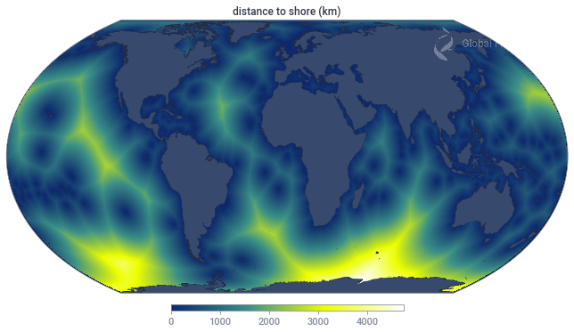


## Auto Colorbar


```python
reload()
with pyseas.context(styles.dark):
    fig = plt.figure(figsize=(12,7))
    maps.plot_raster_w_colorbar(img[::40, ::40], 
                                "distance to shore (km)", 
                                cmap='presence',
                               loc='bottom')
    maps.add_logo(scale=0.8, loc='upper right')
    plt.savefig('/Users/timothyhochberg/Desktop/test_plot.png', dpi=300,
               facecolor=plt.rcParams['pyseas.fig.background'])
```


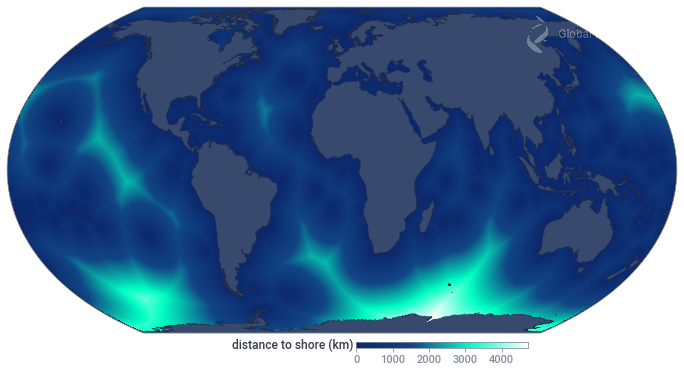


```python
reload()
with pyseas.context(styles.dark):
    fig = plt.figure(figsize=(8, 8))
    ax, im, cb = maps.plot_raster_w_colorbar(img[::40, ::40], 
                                             "km", 
                                             loc="bottom",
                                             projection='regional.atlantic', 
                                             cmap='fishing')
    ax.set_title('distance from shore')
    maps.add_logo()
#     plt.savefig('/Users/timothyhochberg/Desktop/test_plot.png', dpi=300,
#                facecolor=plt.rcParams['pyseas.fig.background'])
```


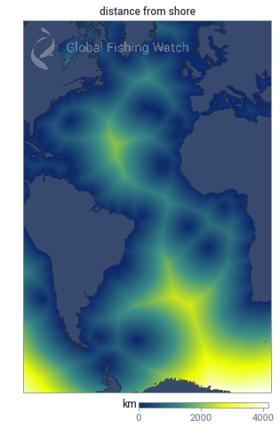


## Adding Gridlines


```python
reload()
with pyseas.context(styles.dark):
    fig = plt.figure(figsize=(12, 8))
    maps.plot_raster_w_colorbar(img[::40, ::40], 
                                             "distance to shore (km)", 
                                             loc="top",
                                             projection='regional.north_pacific', 
                                             cmap='fishing')
    # If axes are not passed most recently used axes are used
    maps.add_gridlines()
    # If gridlines are not passed, last gridlines added are used
    maps.add_gridlabels()
    maps.add_countries()
```


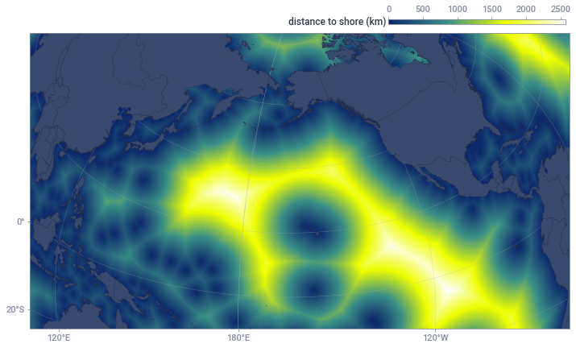


## Plotting Tracks


```python
query = """
    select ssvid, lat, lon, timestamp, seg_id
    from `world-fishing-827.pipe_production_v20200203.messages_segmented_2018*`
    where _TABLE_SUFFIX between "0101" and "0131"
    and ssvid in ("413461490", "249014000", "220413000")
    and seg_id is not null
    order by timestamp
    """
msgs = pd.read_gbq(query, project_id='world-fishing-827', dialect='standard')  
```


```python
ssvids = sorted(set(msgs.ssvid))
ssvids
```


    ['220413000', '249014000', '413461490']


```python
reload()
with pyseas.context(pyseas.styles.light):
    fig = plt.figure(figsize=(10, 10))
    maps.create_map(projection='regional.north_pacific')
    gl = maps.add_gridlines()
    maps.add_gridlabels(gl)
    maps.add_land()
    maps.add_plot(msgs.lon, msgs.lat, msgs.ssvid) 
```


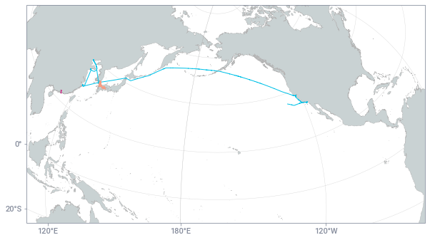


## Predefined Regional Styles


```python
reload()
with pyseas.context(styles.light):
    fig = plt.figure(figsize=(10, 10))
    ax = maps.create_map(projection='country.indonesia')
    maps.add_land(ax)
    maps.add_countries(ax)
    plt.show()
```


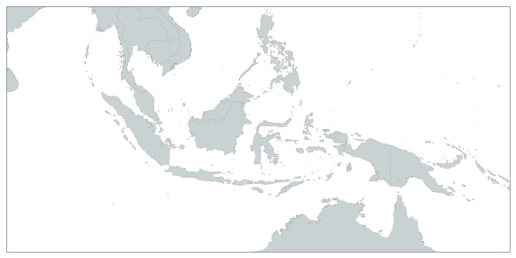


```python
reload()
with pyseas.context(styles.light):
    fig = plt.figure(figsize=(10, 10))
    ax = maps.create_map(projection='regional.south_pacific')
    maps.add_land(ax)
    maps.add_countries(ax)
    plt.show()
```


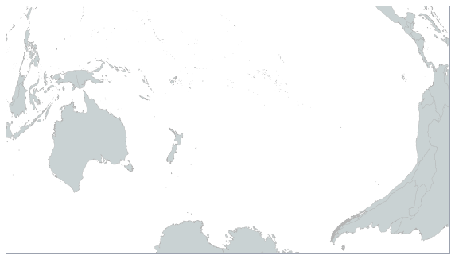


```python
reload()
with pyseas.context(styles.light):
    fig = plt.figure(figsize=(10, 10))
    ax = maps.create_map(projection='country.chile')
    maps.add_land(ax)
    maps.add_countries(ax)
    plt.show()
```


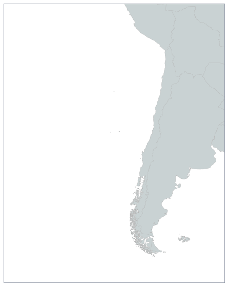


```python
reload()
with pyseas.context(styles.dark):
    fig = plt.figure(figsize=(10, 10))
    ax = maps.create_map(projection='regional.south_pacific')
    maps.add_land(ax)
    maps.add_countries(ax)
    plt.show()
```


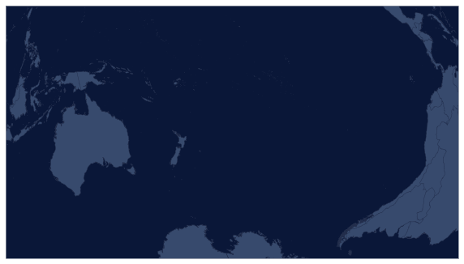


```python
reload()
with pyseas.context(styles.light):
    fig = plt.figure(figsize=(10, 10))
    maps.create_map(projection='country.ecuador_with_galapagos')
    maps.add_land()
    maps.add_countries()
    plt.show()
```


```python
reload()
with pyseas.context(styles.dark):
    fig = plt.figure(figsize=(10, 10))
    ax = maps.create_map(projection='country.indonesia')
    maps.add_land(ax)
    maps.add_countries(ax)
    plt.show()
```


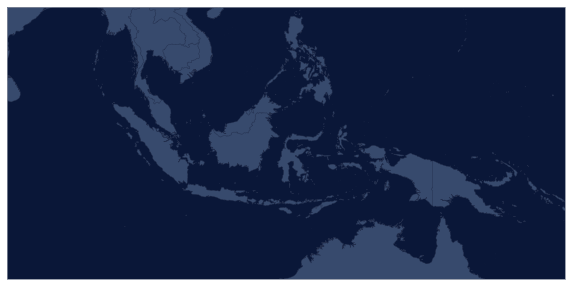


```python
with pyseas.context(styles.dark):
    fig = plt.figure(figsize=(10, 10))
    ax1 = maps.create_map(subplot=(1, 2, 1), projection='country.indonesia')
    maps.add_land(ax1)
    maps.add_countries(ax1)
    ax2 = maps.create_map(subplot=(1, 2, 2), projection='country.peru')
    maps.add_land(ax2)
    maps.add_countries(ax2)
    plt.show()
```


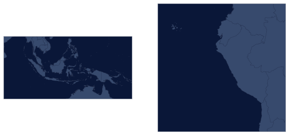


```python

```

## `maps.rasters` has utilities for generating raster from BigQuery.


```python
query = """
with seismic as 
(select distinct ssvid from (
select ssvid, v  from `gfw_research.vi_ssvid_v20200312` cross join
unnest(registry_info.best_known_vessel_class) v
 ) where v = 'seismic_vessel'
 ),
 good_segs as (select seg_id from `gfw_research.pipe_v20190502_segs`  where 
 good_seg and not overlapping_and_short
 and positions > 20)
 select 
 floor(lat*10) lat_bin,
 floor(lon*10) lon_bin,
 sum(hours) hours,
 sum(if(nnet_score>.5,1,0)) fishing_hours
 from `gfw_research.pipe_v20190502` 
 join seismic
 using(ssvid)
 where date between timestamp("2019-01-01") and timestamp("2019-12-31")
 and seg_id in (select seg_id from good_segs)
 group by lat_bin, lon_bin
 """
seismic_presence = pd.read_gbq(query, project_id='world-fishing-827', dialect='standard')  
```


```python
reload()
raster = maps.rasters.df2raster(seismic_presence, 'lon_bin', 'lat_bin', 'hours', 
                                 xyscale=10, origin='lower', per_km2=True)

plt.rc('text', usetex=False)
fig = plt.figure(figsize=(14, 7))
norm = mpcolors.LogNorm(vmin=1, vmax=1000)
with plt.rc_context(styles.dark):
    ax, im, cb = maps.plot_raster_w_colorbar(raster * (60 * 60), 
                                       r"seconds per $\mathregular{km^2}$ ",
                                        projection='country.indonesia',
                                       cmap='presence',
                                      norm=norm,
                                      cbformat='%.0f',
                                      origin='lower',
                                      loc='top')
    maps.add_countries()
    maps.add_eezs()
    ax.set_title('Seismic Vessel Presence Near Indonesia', pad=40)
    maps.add_figure_background()
    gl = maps.add_gridlines()
    maps.add_gridlabels(gl)
    maps.add_logo(loc='lower left')
    plt.savefig('/Users/timothyhochberg/Desktop/test_plot.png', dpi=300,
               facecolor=plt.rcParams['pyseas.fig.background'])
```


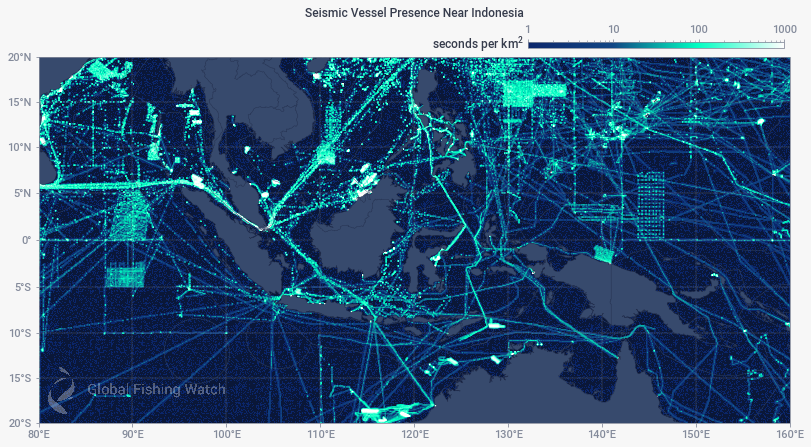


## `contrib`

### Plot Tracks and Lat/Lon vs Time


```python
reload()
import matplotlib.dates as mdates
import datetime as DT

df = msgs[(msgs.ssvid == "413461490")]
reload()
with pyseas.context(styles.panel):
    fig = plt.figure(figsize=(10, 10))
    info = plot_tracks.plot_tracks_panel(df.timestamp, df.lon, df.lat,
                                                 df.seg_id)
    maps.add_logo(loc='upper left')
    
#     print()
    min_dt, max_dt = [mdates.num2date(x) for x in info.plot_axes[0].get_xlim()]
    
    for ax in info.plot_axes:
        if min_dt.hour < 6:
            start = DT.datetime(min_dt.year, min_dt.month, min_dt.day, tzinfo=min_dt.tzinfo) - DT.timedelta(hours=6)
        else:
            start = DT.datetime(min_dt.year, min_dt.month, min_dt.day, tzinfo=min_dt.tzinfo) + DT.timedelta(hours=30)
        while start < max_dt:
            stop = start + DT.timedelta(hours=12)
            if stop > max_dt:
                stop = max_dt
            ax.axvspan(mdates.date2num(start), mdates.date2num(stop), alpha=0.1, color='#888888')
            start += DT.timedelta(hours=24)
            
        ax.set_xlim(min_dt, max_dt)
            


```


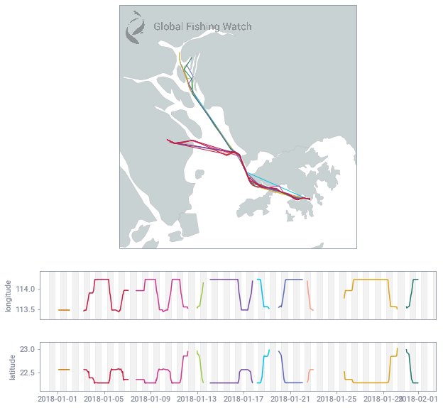


### Plots for examining fishing


```python
query = """
WITH 

good_segs as (
select seg_id from `gfw_research.pipe_v20190502_segs` 
where good_seg and not overlapping_and_short 
and positions > 20),

source as (
select ssvid, vessel_id, timestamp, lat, lon, nnet_score, course, speed, elevation_m
FROM
    `pipe_production_v20190502.messages_scored_201801*`
where seg_id in (select * from good_segs)
),

ssvid_list AS (
SELECT DISTINCT ssvid FROM source
ORDER BY farm_fingerprint(ssvid)
limit 2
)

SELECT source.*
FROM source
WHERE ssvid IN (SELECT * FROM ssvid_list)
ORDER BY timestamp
"""
fishing_df = pd.read_gbq(query, project_id='world-fishing-827', dialect='standard')  
```


```python
reload()
from scipy.signal import medfilt
ssvids = sorted(set(fishing_df.ssvid))[1:]

fishing_props = styles.create_plot_panel_props({
     # Background objects should typically be first
     0 : {'color' : 'purple', 'width' : 1, 'alpha' : 0.8},
     1 : {'color' : 'green', 'width' :1, 'alpha' : 0.8}
     })

with pyseas.context(pyseas.styles.panel):
#     with pyseas.context({'pyseas.map.fishingprops' : fishing_props}):
        for ssvid in ssvids:

            dfn = fishing_df[(fishing_df.ssvid == ssvid) &
                             (fishing_df.timestamp > DT.datetime(2018, 1, 4, 
                                            tzinfo=fishing_df.timestamp[0].tzinfo)) &
                             (fishing_df.timestamp < DT.datetime(2018, 1, 17, 
                                            tzinfo=fishing_df.timestamp[0].tzinfo))]
            dfn = dfn.sort_values(by='timestamp')
            is_fishing = (dfn.nnet_score > 0.5)      

            fig = plt.figure(figsize=(12, 8))
            info = plot_tracks.plot_fishing_panel(dfn.timestamp, dfn.lon,
                                     dfn.lat, is_fishing,
                                     plots = [
                    {'label' : 'speed (knots)', 'values' : medfilt(dfn.speed.values,11), 
                        'min_y' : 0},
                    {'label' : 'depth (km)', 'values' : -dfn.elevation_m / 1000,
                        'min_y' : 0, 'invert_yaxis' : True},                       
                                     ],
                                     map_ratio=6,
                                     annotations=7,
                                    annotation_y_loc=1,
                                    annotation_y_align='bottom',
                                    annotation_axes_ndx=0,
                                    add_night_shades=True)

            maps.add_scalebar()

            plt.savefig('/Users/timothyhochberg/Desktop/test_fpanel.png', dpi=300,
                       facecolor=plt.rcParams['pyseas.fig.background'])

            plt.show()
```


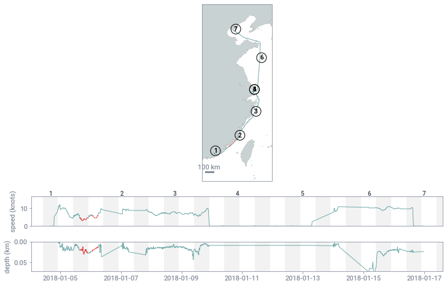


### Basic annotations can be added that match map to time axis


```python
from pyseas import props
reload()
from pyseas.util import lon_avg, asarray

ssvids = sorted(set(fishing_df.ssvid))[1:2]

# The props for annotations can be tweaked
props = {'pyseas.map.annotationmapprops' : dict(
           fontdict={'color' : 'blue', 'weight': 'bold', 'size' : 10},
            bbox=dict(facecolor='none', edgecolor='blue', boxstyle='circle')),
        'pyseas.map.annotationplotprops' : dict(fontdict={'size' : 12, 'color' : 'blue',
                                                      'weight' : 'bold'})

        }

with pyseas.context(pyseas.styles.panel):
#     with pyseas.context(props):
        for ssvid in ssvids:

            dfn = fishing_df[fishing_df.ssvid == ssvid]
            dfn = dfn.sort_values(by='timestamp')
            is_fishing = (dfn.nnet_score > 0.5)      

            fig = plt.figure(figsize=(12, 12))
            info = plot_tracks.plot_fishing_panel(dfn.timestamp, dfn.lon,
                                     dfn.lat, is_fishing,
                                     plots = [
                    {'label' : 'speed (knots)', 'values' : medfilt(dfn.speed.values,11), 
                        'min_y' : 0},
                    {'label' : 'depth (km)', 'values' : -dfn.elevation_m / 1000,
                        'min_y' : 0, 'invert_yaxis' : True}, 
                                     ],
                                     map_ratio=6,
                                     annotations=7,
                                     add_night_shades=True)

            maps.add_scalebar()
                
            maps.add_gridlines()
            maps.add_gridlabels()

            plt.savefig('/Users/timothyhochberg/Desktop/test_fpanel.png', dpi=300,
                       facecolor=plt.rcParams['pyseas.fig.background'])

            plt.show()
```


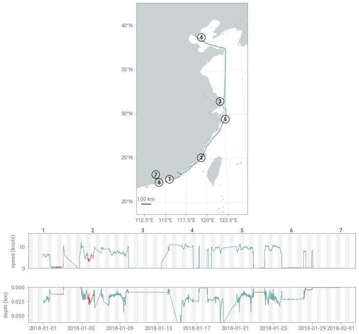


A ProjectionInfo instance can be passed in rather than having plot_tracks compute
a suitable projection


```python

projinfo = plot_tracks.ProjectionInfo(
    projection=cartopy.crs.EqualEarth(central_longitude=160),
    extent=None, # For EqualEarth or other full globe projection use None, otherwise set appropriately
    description='EqualEarth * 160°E',
    central_longitude=160,
    central_latitude=None)

with pyseas.context(pyseas.styles.panel):
#     with pyseas.context(props):
        for ssvid in ssvids:

            dfn = fishing_df[fishing_df.ssvid == ssvid]
            dfn = dfn.sort_values(by='timestamp')
            is_fishing = (dfn.nnet_score > 0.5)      

            fig = plt.figure(figsize=(12, 12))
            info = plot_tracks.plot_fishing_panel(dfn.timestamp, dfn.lon,
                                     dfn.lat, is_fishing,
                                     plots = [
                    {'label' : 'speed (knots)', 'values' : medfilt(dfn.speed.values,11), 
                        'min_y' : 0},
                    {'label' : 'depth (km)', 'values' : -dfn.elevation_m / 1000,
                        'min_y' : 0, 'invert_yaxis' : True}, 
                                     ],
                                     map_ratio=6,
                                     annotations=0,
                                     add_night_shades=True,
                                     projection_info=projinfo)

            maps.add_scalebar(skip_when_extent_large=True)
                
            maps.add_gridlines()
            maps.add_gridlabels()

            plt.savefig('/Users/timothyhochberg/Desktop/test_fpanel.png', dpi=300,
                       facecolor=plt.rcParams['pyseas.fig.background'])

            plt.show()
```


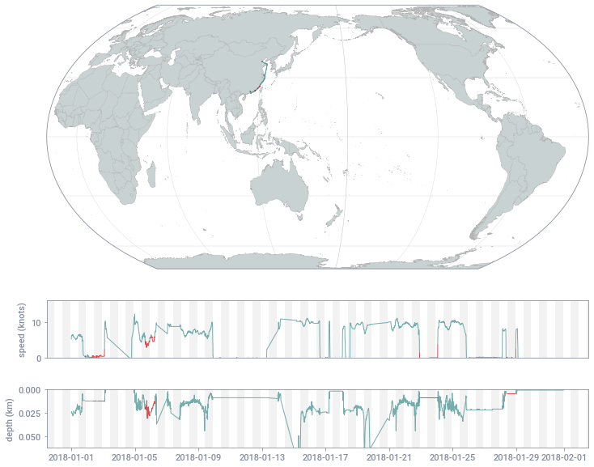


## A mini globe can be used to help locate the main map.


```python
reload()
raster = maps.rasters.df2raster(seismic_presence, 'lon_bin', 'lat_bin', 'hours', 
                                 xyscale=10, origin='lower', per_km2=True)

mask = {'pyseas.miniglobe.overlaycolor' : pyseas.props.dark.ocean.color}

plt.rc('text', usetex=False)
fig = plt.figure(figsize=(14, 7))
norm = mpcolors.LogNorm(vmin=1, vmax=1000)
with plt.rc_context(styles.dark):
    ax, im, cb = maps.plot_raster_w_colorbar(raster * (60 * 60), 
                                       r"seconds per $\mathregular{km^2}$ ",
                                        projection='country.indonesia',
                                       cmap='presence',
                                      norm=norm,
                                      cbformat='%.0f',
                                      origin='lower',
                                      loc='top')
    maps.add_countries()
    maps.add_eezs()
    ax.set_title('Seismic Vessel Presence Near Indonesia', pad=40)
    maps.add_figure_background()
    gl = maps.add_gridlines()
    maps.add_logo(loc='lower right')
    h, w = raster.shape
    n = 10
    small_raster = raster[:h - h % n, :w - w % n].reshape(h // n, n, w // n, n).mean(axis=(1, 3))
    inset = maps.add_miniglobe(loc='lower left')
#     maps.add_raster(small_raster * (60 * 60), ax=inset, norm=norm, origin='lower', cmap='presence')
#     with pyseas.context(mask):
#         maps.core.add_minimap_aoi(ax, inset)
#     maps.add_land(ax=inset)
#     maps.core.add_minimap_aoi(ax, inset)

#     plt.savefig('/Users/timothyhochberg/Desktop/test_plot.png', dpi=300,
#                facecolor=plt.rcParams['pyseas.fig.background'])
```


    ---------------------------------------------------------------------------

    NameError                                 Traceback (most recent call last)

    <ipython-input-42-127675aaf514> in <module>()
          1 reload()
    ----> 2 raster = maps.rasters.df2raster(seismic_presence, 'lon_bin', 'lat_bin', 'hours', 
          3                                  xyscale=10, origin='lower', per_km2=True)
          4 
          5 mask = {'pyseas.miniglobe.overlaycolor' : pyseas.props.dark.ocean.color}


    NameError: name 'seismic_presence' is not defined


```python
reload()
local_props = {'pyseas.miniglobe.innerwidth' : 3}


fig = plt.figure(figsize=(14, 7))
norm = mpcolors.LogNorm(vmin=1, vmax=1000)
with pyseas.context(styles.light):
    with pyseas.context(local_props):
        ax = maps.create_map(projection='country.indonesia')
        maps.add_land()
        maps.add_countries()
        maps.add_eezs()
        gl = maps.add_gridlines()
        maps.add_miniglobe()#central_marker='*', marker_size=10, marker_color='black')
```


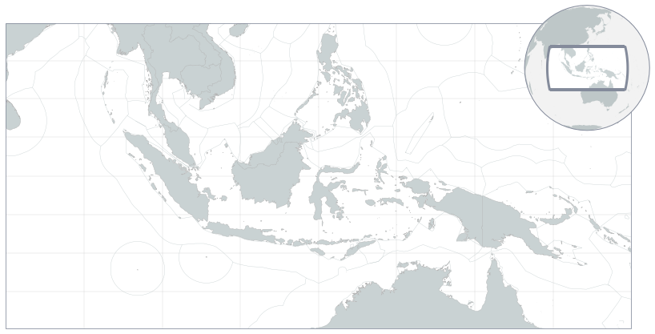


## Publish


```python
# import rendered
# rendered.publish_to_github('./Examples.ipynb', 
#                            'pyseas/doc', action='push')
```


```python
SELECT * FROM `machine_learning_dev_ttl_120d.test_tracks_voyages_v20200930b` 
where ssvid = '416002325' AND trip_start > TIMESTAMP('2018-01-01') ORDER BY trip_start
```


```python
query = '''
select a.ssvid, timestamp, lon, lat, course, speed, a.track_id, trip_id, trip_start
from `machine_learning_dev_ttl_120d.thinned_messages_v20200709_2018*` a 
left join `machine_learning_dev_ttl_120d.test_tracks_voyages_v20200930b` b
on a.ssvid = b.ssvid and a.track_id = b.track_id and timestamp between trip_start and trip_end 
where a.ssvid = '416002325'
order by timestamp
'''
ex_416002325 = pd.read_gbq(query, project_id='world-fishing-827', dialect='standard')  
```


```python
with pyseas.context(styles.panel):
    for track_id in sorted(set(ex_416002325.track_id)):
        df = ex_416002325[ex_416002325.track_id == track_id]
        fig = plt.figure(figsize=(10, 14))
        info = plot_tracks.plot_tracks_panel(df.timestamp, df.lon, df.lat)
        maps.add_miniglobe()
        plt.show()
```


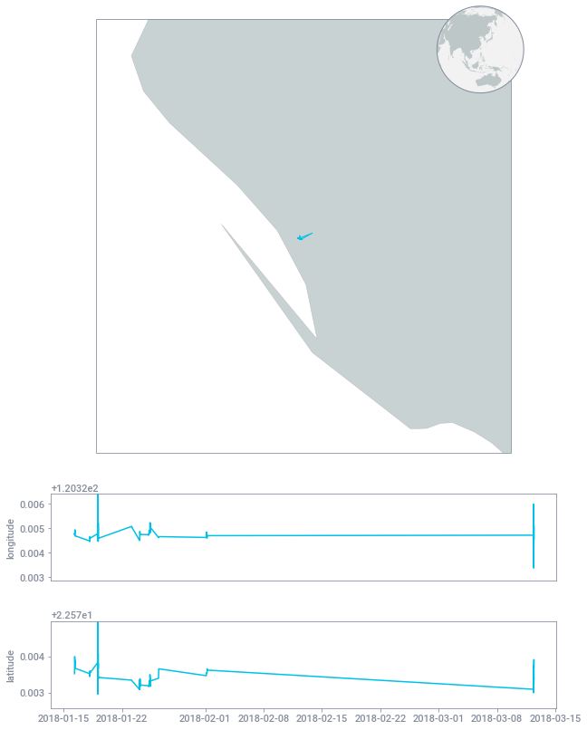


```python
start_map = {x.trip_id : x.trip_start for x in ex_416002325.itertuples()}
```


```python
start_map = {x.trip_id : x.trip_start for x in ex_416002325.itertuples()}
with pyseas.context(styles.panel):
    for trip_id in sorted(set(ex_416002325.trip_id), key = lambda x : start_map[x]):
        df = ex_416002325[ex_416002325.trip_id == trip_id]
        fig = plt.figure(figsize=(10, 14))
        info = plot_tracks.plot_fishing_panel(df.timestamp, df.lon, df.lat, df.lat * 0)
```


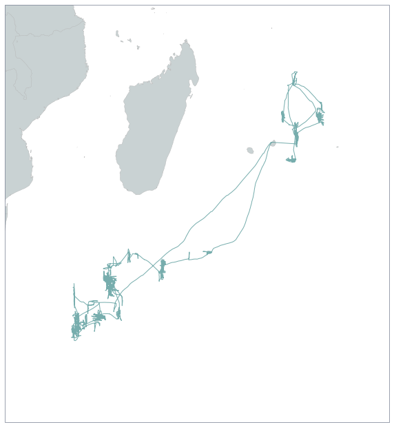


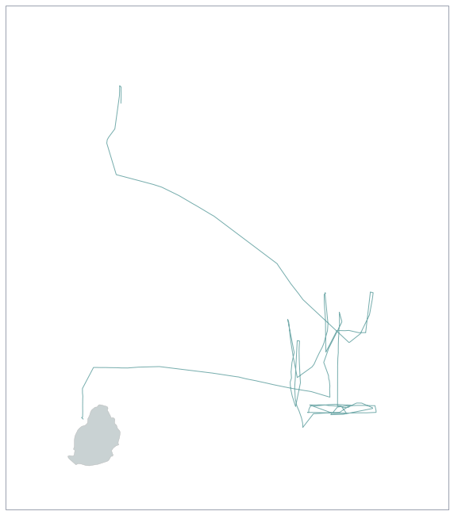


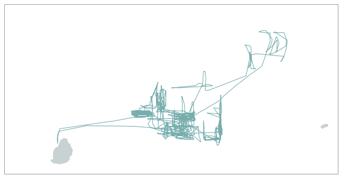


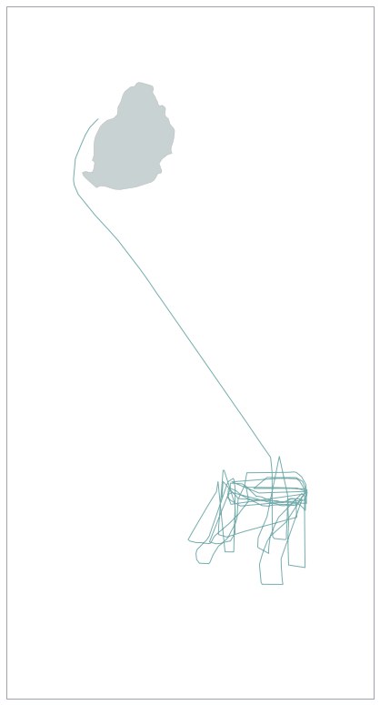


```python
query = '''
select a.ssvid, timestamp, lon, lat, course, speed, a.track_id, trip_id, trip_start
from `machine_learning_dev_ttl_120d.thinned_messages_v20200709_2017*` a 
left join `machine_learning_dev_ttl_120d.test_tracks_voyages_v20200930b` b
on a.ssvid = b.ssvid and a.track_id = b.track_id and timestamp between trip_start and trip_end 
where a.ssvid = '416005359' and timestamp > timestamp('2017-07-11')
order by timestamp
'''
ex_416005359 = pd.read_gbq(query, project_id='world-fishing-827', dialect='standard')  
```


```python
with pyseas.context(styles.panel):
    for track_id in sorted(set(ex_416005359.track_id)):
        df = ex_416005359[ex_416005359.track_id == track_id]
        fig = plt.figure(figsize=(10, 14))
        info = plot_tracks.plot_tracks_panel(df.timestamp, df.lon, df.lat)
        maps.add_miniglobe()
        plt.show()
```


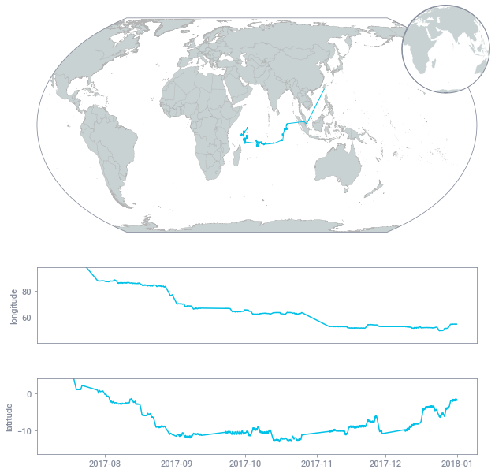


```python
start_map = {x.trip_id : x.trip_start for x in ex_416005359.itertuples()}
with pyseas.context(styles.panel):
    for trip_id in sorted(set(ex_416005359.trip_id), key = lambda x : start_map[x]):
        if trip_id is None:
            continue
        df = ex_416005359[ex_416005359.trip_id == trip_id]
        fig = plt.figure(figsize=(10, 14))
        print(trip_id, len(df))
        info = plot_tracks.plot_fishing_panel(df.timestamp, df.lon, df.lat, df.lat * 0)
```

    416005359-2017-05-26T04:09:11.000000Z-2017-05-26--3882683afc00 2
    416005359-2017-05-26T04:09:11.000000Z-2017-05-26-015d2f5b1e58 2
    416005359-2017-05-26T04:09:11.000000Z-2017-05-26-015d65cc2d10 5381


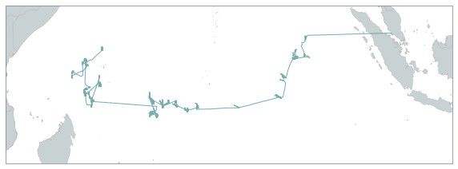


```python
# SELECT  * FROM `world-fishing-827.pipe_production_v20190502.port_events_*` 
# WHERE
# vessel_id = '308bedf1d-d12b-f775-8e6a-2ee85fe1f307'
# AND
# timestamp>=timestamp('2017-07-11')
# ORDER BY
# timestamp
```


```python
reload()
with pyseas.context(styles.dark):
    fig = plt.figure(figsize=(18, 6))
    ax = maps.create_map(projection='global.pacific_centered')
    maps.add_land()
    maps.core._last_projection = 'global.pacific_centered'
    maps.add_logo(loc=(0.6, 0.7))
```


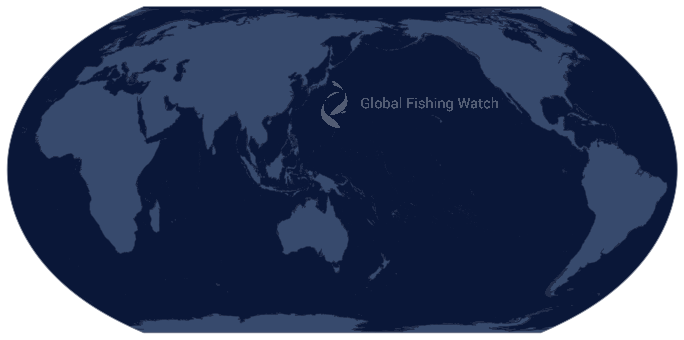


```python
maps.core._last_projection
```


    'global.pacific_centered'


```python
from collections import Counter
Counter(msgs.seg_id).most_common(6)
```


    [('220413000-2017-12-18T20:34:03.000000Z', 8647),
     ('249014000-2017-12-24T22:05:19.000000Z', 3089),
     ('220413000-2018-01-20T01:01:17.000000Z', 1444),
     ('249014000-2018-01-21T16:36:23.000000Z', 1233),
     ('249014000-2018-01-28T05:05:07.000000Z', 998),
     ('249014000-2018-01-15T00:21:43.000000Z', 976)]


```python
df_positions_all = msgs

with pyseas.context(pyseas.styles.light):
    with pyseas.context({'pyseas.eez.bordercolor' : 'black'}):
        fig = plt.figure(figsize=(8, 8))
    #     fig = plt.figure()
        df_positions_gap = df_positions_all[df_positions_all.seg_id 
                                            == '249014000-2018-01-21T16:36:23.000000Z']
        df_positions_carrier = df_positions_all[df_positions_all.seg_id 
                                                == '249014000-2018-01-15T00:21:43.000000Z']

        if True:
            extent = [df_positions_gap.lon.min(), df_positions_gap.lon.max(), \
                      df_positions_gap.lat.min(), df_positions_gap.lat.max()]
        im_buffer_prop = 0.1 # proportion of lat or lon to use to buffer out the extent
        im_buffer_lon = (extent[1] - extent[0]) * im_buffer_prop
        im_buffer_lat = (extent[3] - extent[2]) * im_buffer_prop
        maps.create_map(projection='global.default',
                       extent=[extent[0] - im_buffer_lon, extent[1] + im_buffer_lon, \
                               extent[2] - im_buffer_lat, extent[3] + im_buffer_lat])

        gl = maps.add_gridlines()
        maps.add_gridlabels(gl)
        maps.add_land()
        maps.add_eezs()

        ### Add the inset where it's working currently
        try:
            inset = maps.add_miniglobe(loc='lower left', offset="outside")
        except:
            inset = None
            
        def make_props(color):
            return {'edgecolor' : color,
                 'facecolor' : 'none',
                 'linewidth' : 1,
                 'alpha' : 1}

        maps.add_plot(df_positions_gap.lon.values, df_positions_gap.lat.values, 
                     props={(1, 1) :  make_props('red')})
        maps.add_plot(df_positions_carrier.lon.values, df_positions_carrier.lat.values, 
                     props={(1, 1) :  make_props('blue')})
```


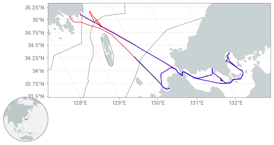


```python

```
