# Projection Info
Name | Projection | Extent | Thumbnail
------ | -------- | ------ | ---------
global.default | EqualEarth @ 0°E |  | 
global.atlantic_centered | EqualEarth @ 40°W |  | 
global.pacific_centered | EqualEarth @ 150°E |  | 
global.indian_centered | EqualEarth @ 70°E |  | 
regional.north_pacific | Lambert azimuthal equal area @ 165°E,25°N <em>+proj=laea +lat_0=25 +lon_0=-160</em> | (250°W&nbsp;10°S) (70°W&nbsp;60°N) | 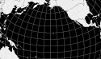
regional.south_pacific | Lambert azimuthal equal area @ 140°W,0°S <em>+proj=laea +lat_0=-30 +lon_0=-160</em> | (250°W&nbsp;70°S) (70°W&nbsp;10°N) | 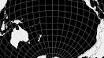
regional.pacific | Lambert azimuthal equal area @ 165°W,0°N <em>+proj=laea +lat_0=0 +lon_0=-160</em> | (250°W&nbsp;65°S) (70°W&nbsp;65°N) | 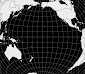
regional.atlantic | Lambert azimuthal equal area @ 30°W,0°S <em>+proj=laea +lat_0=0 +lon_0=-30</em> | (80°W&nbsp;75°S) (20°E&nbsp;75°N) | 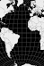
regional.north_atlantic | Lambert azimuthal equal area @ 30°W,0°S <em>+proj=laea +lat_0=35 +lon_0=-30</em> | (80°W&nbsp;5°S) (20°E&nbsp;75°N) | 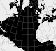
regional.south_atlantic | Lambert azimuthal equal area @ 30°W,0°S <em>+proj=laea +lat_0=-35 +lon_0=-20</em> | (55°W&nbsp;55°S) (15°E&nbsp;5°N) | 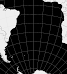
regional.indian | Lambert azimuthal equal area @ 75°E,0°N <em>+proj=laea +lat_0=-20 +lon_0=80</em> | (20°E&nbsp;30°S) (140°E&nbsp;70°N) | 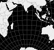
regional.european_union | Albers equal area conic @ 15°E,50°N <em>=proj=aea +lat_1=33.3333333333333 +lat_2=66.6666666666666 +lon_0=15</em> | (25°W&nbsp;25°N) (55°E&nbsp;75°N) | 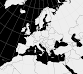
country.indonesia | Lambert cylindrical @ 120°E <em>+proj=cea +lat_ts=0 +lon_0=-240</em> | (80°E&nbsp;20°S) (160°E&nbsp;20°N) | 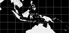
country.ecuador_with_galapagos | Lambert cylindrical @ 85°W <em>+proj=cea +lat_ts=0 +lon_0=-85</em> | (97°W&nbsp;10°S) (73°W&nbsp;5°N) | 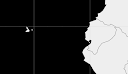
country.japan | Lambert azimuthal equal area @ 137°E,38°N <em>+proj=laea +lat_0=38 +lon_0=140</em> | (125°E&nbsp;26°N) (155°E&nbsp;50°N) | 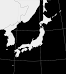
country.chile | Lambert azimuthal equal area @ 80°W <em>+proj=laea +lat_0=-35 +lon_0=-80</em> | (100°W&nbsp;60°S) (60°W&nbsp;10°S) | 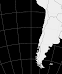
country.peru | Lambert azimuthal equal area @ 80°W <em>+proj=laea +lon_0=-80</em> | (95°W&nbsp;25°S) (65°W&nbsp;5°N) | 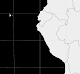
country.panama | Lambert azimuthal equal area @ 80°W <em>+proj=laea +lon_0=-80</em> | (88°W&nbsp;2°S) (72°W&nbsp;15°N) | 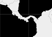