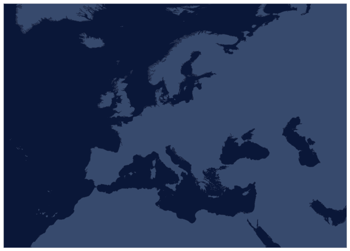
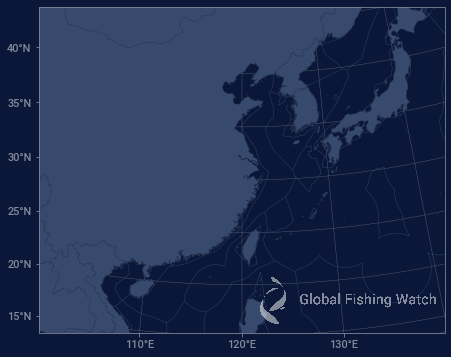
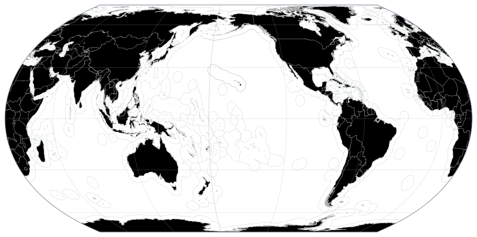
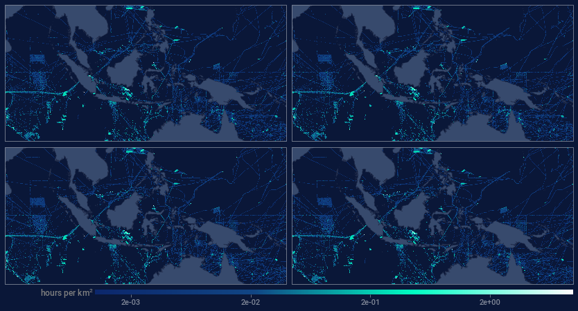
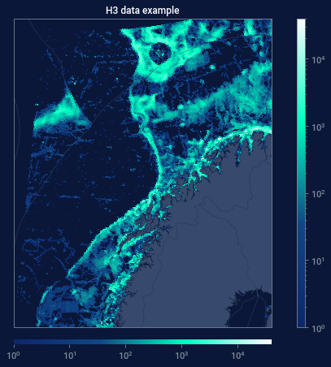
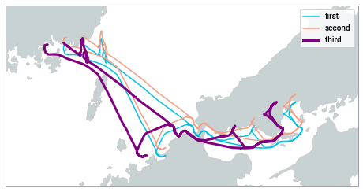
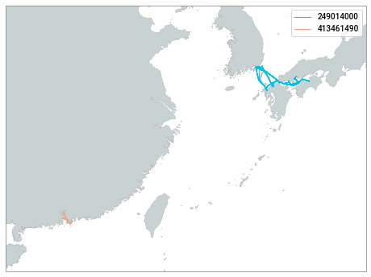
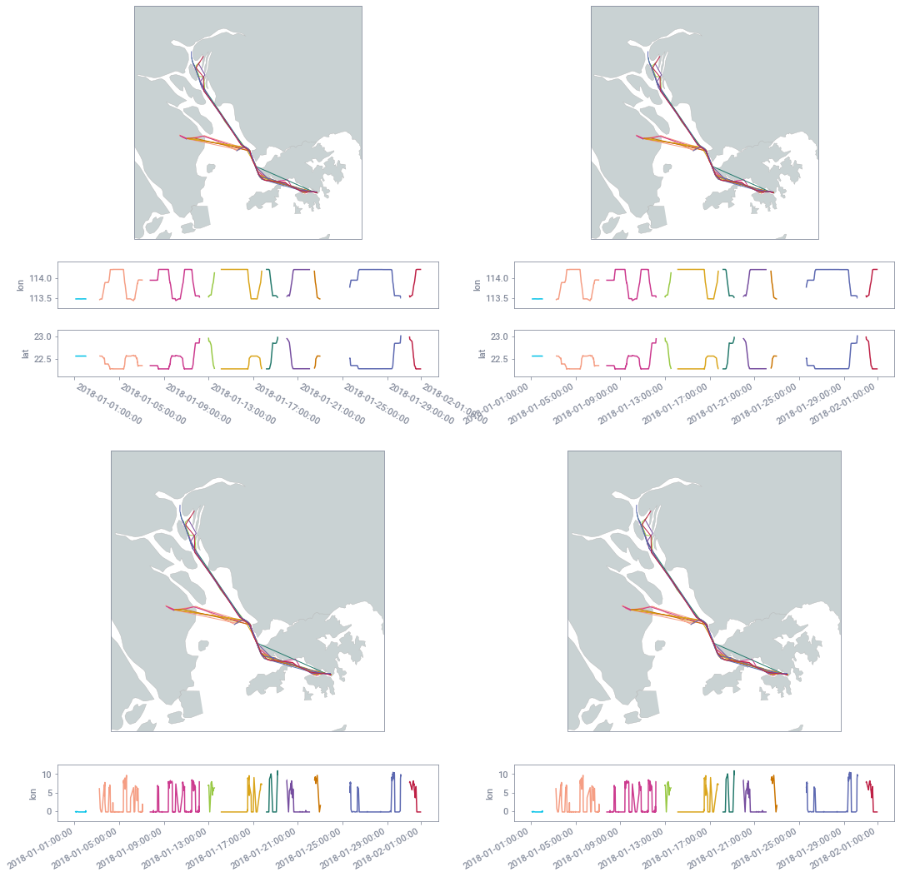
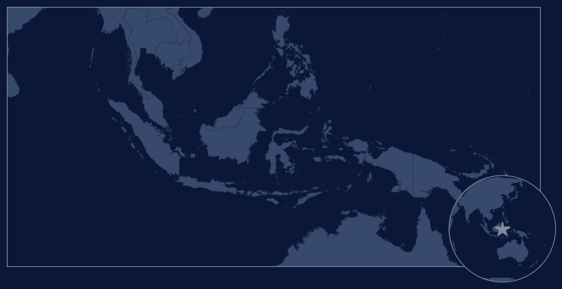

# Examples of Plotting with *pyseas*


```python
import numpy as np
import matplotlib.pyplot as plt
import matplotlib.colors as mpcolors
import matplotlib.gridspec as gridspec
import matplotlib.patches as mppatches
from matplotlib.transforms import Affine2D
from pathlib import Path
import skimage.io
import pandas as pd
import cartopy
from pandas.plotting import register_matplotlib_converters

register_matplotlib_converters()

import pyseas.maps as psm
import pyseas.contrib as psc
import pyseas.cm

%matplotlib inline

data_dir = Path("..") / "doc" / "data"
```

## Recomended Style

     import pyseas.maps as psm

## Basic Mapping

Projections can be specified by using any of the names found in the acompanying
`projection_info.md` document, or with any Cartopy projection. There are built in
light and dark styles, which are activated using `pyseas.context`.


```python
with psm.context(psm.styles.dark):
    fig = plt.figure(figsize=(18, 6))
    psm.create_map(projection="regional.european_union")
    psm.add_land()
```


    

    


In addition to `add_land` there a number of other features that can be added to maps
including eezs, grid_lines, countries, logos, etc. If you add a logo, without specifying
the image to use, you'll get the PySeas logo.


```python
with psm.context(psm.styles.light):
    fig = plt.figure(figsize=(18, 6))
    psm.create_map(projection="country.china")
    psm.add_land()
    psm.add_countries()
    psm.add_eezs()
    psm.add_gridlines()
    psm.add_gridlabels()
    psm.add_logo(loc="upper left")
```


    

    


More commonly you'll want to either specify a custom logo as shown here, or set the default
logo as shown below.


```python
light_logo = skimage.io.imread("../data/logos/picc_black.png")

with psm.context(psm.styles.light):
    fig = plt.figure(figsize=(18, 6))
    psm.create_map(projection="country.china")
    psm.add_land()
    psm.add_countries()
    psm.add_eezs()
    psm.add_gridlines()
    psm.add_gridlabels()
    psm.add_logo(light_logo, loc="lower right", scale=0.2)
```


    

    


`set_default_logos` accepts Google Cloud Storage paths prefixed with
either `gs://` or `gcs://`. Logos loaded this way are locally cached.
For example, if your logos are located at `gs://pyseas/logos/`, you can
use the following:


```python
psm.styles.set_default_logos(
    light_logo="gs://pyseas/logos/logo_black.png",
    dark_logo="gs://pyseas/logos/logo_white.png",
    scale_adj=1.0,
    alpha=0.5,
)

with psm.context(psm.styles.dark):
    fig = plt.figure(figsize=(18, 6))
    psm.create_map(projection="country.china")
    psm.add_land()
    psm.add_countries()
    psm.add_eezs()
    psm.add_gridlines()
    psm.add_gridlabels()
    psm.add_logo(loc="lower right")
```


    

    


If region is not specified, you get the default global map as specified by the
projection name `global.default`. Currently that's ExactEarth centered at 0 longitude.


```python
with psm.context(psm.styles.light):
    fig = plt.figure(figsize=(18, 6))
    psm.create_map()
    psm.add_land()
    psm.add_countries()
    psm.add_eezs()
    psm.add_gridlines()
    # Note gridlabels don't currently work on global maps
```


    

    


```python
# If you don't need to show the Mediterraean, you can show the major oceans
# with the "global.pacific_157w" projection
with psm.context(psm.styles.light):
    fig = plt.figure(figsize=(18, 6))
    psm.create_map(projection="global.pacific_157w")
    psm.add_land()
    psm.add_countries()
    psm.add_eezs()
    psm.add_gridlines()
```


    

    


## Rasters

There are facilities for creating and displaying rasters.


```python
# # Grab some data and create a raster
seismic_presence = pd.read_csv(data_dir / "seismic_presence_tenth_degree.csv.zip")
seismic_raster = psm.rasters.df2raster(
    seismic_presence,
    "lon_index",
    "lat_index",
    "hours",
    xyscale=10,
    origin="lower",
    per_km2=True,
)
```


```python
# Display a raster along with standard colorbar.
fig = plt.figure(figsize=(14, 7))
norm = mpcolors.LogNorm(vmin=0.001, vmax=10)
with psm.context(psm.styles.dark):
    with psm.context({"text.color": "white"}):
        ax, im = psm.plot_raster(
            seismic_raster,
            projection="country.indonesia",
            cmap="presence",
            norm=norm,
            origin="lower",
        )
        cbax = psm.add_colorbar(im, label=r"hours per $\mathregular{km^2}$", width=0.5)
        cbax.tick_params(labelsize=16)
```


    

    


```python
cbax.collections
```


    <Axes.ArtistList of 2 collections>


```python
# Display a raster along with standard colorbar.
fig = plt.figure(figsize=(14, 7))
norm = mpcolors.LogNorm(vmin=0.001, vmax=10)
with plt.rc_context(psm.styles.dark):
    ax, im = psm.plot_raster(
        seismic_raster,
        projection="country.indonesia",
        cmap="presence",
        norm=norm,
        origin="lower",
    )
    psm.add_countries()
    psm.add_eezs()
    ax.set_title("Seismic Vessel Presence Near Indonesia")
    fig.colorbar(
        im,
        ax=ax,
        orientation="horizontal",
        fraction=0.02,
        aspect=40,
        pad=0.04,
    )
```


    

    


`add_colorbar` can be used with subplots. Here we just plot the same
thing twice and add a colorbar to the last plot.


```python
fig = plt.figure(figsize=(14, 14))
norm = mpcolors.LogNorm(vmin=0.001, vmax=10)
gs = gridspec.GridSpec(2, 1)
with plt.rc_context(psm.styles.dark):
    with psm.context({"text.color": "white"}):
        for i in range(2):
            ax, im = psm.plot_raster(
                seismic_raster,
                subplot=gs[i, 0],
                projection="country.indonesia",
                cmap="presence",
                norm=norm,
                origin="lower",
            )
            ax.set_title(f"Seismic Vessel Presence Near Indonesia - {i + 1}")
        psm.add_colorbar(im, label=r"hours per $\mathregular{km^2}$ ")
```


    

    


```python
fig = plt.figure(figsize=(14.7, 7.6))
norm = mpcolors.LogNorm(vmin=0.001, vmax=10)
gs = gridspec.GridSpec(2, 2, hspace=0, wspace=0.02)
with plt.rc_context(psm.styles.dark):
    with psm.context({"text.color": (0.5, 0.5, 0.5)}):
        for i in range(2):
            for j in range(2):
                ax, im = psm.plot_raster(
                    seismic_raster,
                    subplot=gs[i, j],
                    projection="country.indonesia",
                    cmap="presence",
                    norm=norm,
#                     origin="lower",
                )
        psm.add_left_labeled_colorbar(
            im,
            ax=ax,
            label=r"hours per $\mathregular{km^2}$",
            width=1.7,
            height=0.035,
            wspace=0.0025,
            valign=0.2,
        )
```


    

    


If a grid of maps using the same projection is being plotted, one can instead
use `create_maps`, which mirrors the interface of `plt.subplots`


```python
norm = mpcolors.LogNorm(vmin=0.001, vmax=10)
with plt.rc_context(psm.styles.dark):
    fig, axes = psm.create_maps(
        2, 2, projection="country.indonesia", figsize=(14.7, 7.6)
    )
    with psm.context({"text.color": (0.5, 0.5, 0.5)}):
        for row in axes:
            for ax in row:
                im = psm.add_raster(
                    seismic_raster, ax=ax, cmap="presence", norm=norm, origin="lower"
                )
        psm.add_colorbar(
            im,
            ax=ax,
            label=r"hours per $\mathregular{km^2}$",
            width=1.7,
            height=0.035,
            wspace=0.0025,
            valign=0.2,
        )

        plt.subplots_adjust(hspace=0, wspace=0.02)
```


    

    


```python
# Display a raster along with standard colorbar.
fig = plt.figure(figsize=(14, 7))
norm = mpcolors.LogNorm(vmin=0.001, vmax=10)
with psm.context(psm.styles.dark):
    with psm.context({"text.color": "white"}):
        fig, ax = psm.create_maps(projection="country.indonesia", figsize=(14.7, 7.6))
        psm.add_raster(seismic_raster, cmap="presence", norm=norm, origin="lower")
        psm.add_colorbar(im, label=r"hours per $\mathregular{km^2}$", loc="bottom")
```


    <Figure size 1008x504 with 0 Axes>


    

    


If you want to make sure to fill the space in the subplots without fiddling with
the projections, you can use `ax.set_adjustable("datalim")`.

The recipe below plots multiple plots with different locations and zoom levels on
different GridSpecs and fills in each plot.


```python
proj_info = [  # lon_center, lat_center, approximate_size in degrees
    [(120.0, 0.0, 20.0), (140.99, 37.82, 10.0)],
    [(-85.0, -2.50, 12.0), (-80.0, -34.63, 20)],
    [(120.0, 0.0, 13.5), (-80.0, 6.50, 4.0)],
]

gspecs = [[(0, slice(0, 2)), (slice(0, 2), 2)],
          [(1, 0), (1, 1)],
          [(2, slice(0, 2)), (2, 2)]]

fig = plt.figure(figsize=(14, 14))
norm = mpcolors.LogNorm(vmin=0.001, vmax=10)
gs = gridspec.GridSpec(3, 3)
with psm.context(psm.styles.dark):
    with psm.context({"text.color": "white"}):
        for i in range(3):
            for j in range(2):
                xc, yc, dx_x_2 = proj_info[i][j]
                dx = dx_x_2 / 2
                prj = cartopy.crs.LambertAzimuthalEqualArea(xc, yc)
                ax = psm.create_map(subplot=gs[gspecs[i][j]], projection=prj)
                psm.add_raster(seismic_raster, norm=norm, origin="lower")
                psm.add_land()
                ax.set_extent((xc - dx, xc + dx, yc - dx, yc + dx), crs=psm.identity)
                ax.set_adjustable("datalim")
```


    

    


```python
proj_info = [  # lon_center, lat_center, approximate_size in degrees
    [(120.0, 0.0, 20.0), (140.99, 37.82, 10.0)],
    [(-85.0, -2.50, 12.0), (-80.0, -34.63, 20)],
    [(120.0, 0.0, 13.5), (-80.0, 6.50, 4.0)],
]

gspecs = [[(0, slice(0, 2)), (slice(0, 2), 2)],
          [(1, 0), (1, 1)],
          [(2, slice(0, 2)), (2, 2)]]

fig = plt.figure(figsize=(14, 14))
norm = mpcolors.LogNorm(vmin=0.001, vmax=10)
gs = gridspec.GridSpec(3, 3)
with psm.context(psm.styles.dark):
    with psm.context({"text.color": "white"}):
        for i in range(3):
            for j in range(2):
                xc, yc, dx_x_2 = proj_info[i][j]
                dx = dx_x_2 / 2
                prj = cartopy.crs.LambertAzimuthalEqualArea(xc, yc)
                ax = psm.create_map(subplot=gs[gspecs[i][j]], projection=prj)
                psm.add_raster(seismic_raster, norm=norm, origin="lower")
                psm.add_land()
                ax.set_extent((xc - dx, xc + dx, yc - dx, yc + dx), crs=psm.identity)
                ax.set_adjustable("datalim")
plt.tight_layout()
```

    /Users/timothyhochberg/anaconda3/envs/pyseas/lib/python3.7/site-packages/ipykernel_launcher.py:26: UserWarning: Tight layout not applied. The left and right margins cannot be made large enough to accommodate all axes decorations.


    

    


### H3 Discrete Global Grids

There is also support for rendering data defined in terms of H3 DGG as rasters

N.B. this relies on `h3.unstable`, so might require modification to work in the future.


```python
fishing_h3_6 = pd.read_csv(data_dir / "fishing_h3_lvl6.csv.zip")
h3cnts_6_b = {np.uint64(int(x.h3, 16)): x.cnt for x in fishing_h3_6.itertuples()}
```


```python
fig = plt.figure(figsize=(14, 7))
norm = mpcolors.LogNorm(1, 40000)
with psm.context(psm.styles.dark):
    ax, im = psm.plot_h3_data(
        h3cnts_6_b,
        projection=cartopy.crs.LambertAzimuthalEqualArea(
            central_longitude=10, central_latitude=60
        ),
        extent=(3.8, 25.0, 65.0, 75.4),
        cmap="presence",
        norm=norm,
    )
    psm.add_countries()
    psm.add_eezs()
    ax.set_title("H3 data example")
    psm.add_colorbar(im, width=1.0)
    # Or
    plt.colorbar(
        im,
        ax=ax,
        orientation="vertical",
        fraction=0.02,
        aspect=40,
        pad=0.04,
    )
```


    

    


## Plotting Tracks

There are two base functions for plotting vessel tracks. `maps.plot` is
a simple wrapper around `plt.plot` that plots tracks specified in lat/lon,
but is otherwise identical `plt.plot`. The alternative, `maps.add_plot` can plot plot tracks
with multiple subsegments, using different styles for each subsegment.

Both of these support creation of legends. However, the second requires a bit
of manual intervention.


```python
position_msgs = pd.read_csv(data_dir / "position_messages.csv.zip")
position_msgs["timestamp"] = pd.to_datetime(position_msgs.timestamp)
```

Note the use of `maps.find_projection` to find an appropriate projection and extents
based on lat/lon data.


```python
# Simple track plotting analogous to plt.plot
with psm.context(psm.styles.light):
    fig = plt.figure(figsize=(8, 8))
    df = position_msgs[position_msgs.seg_id == "249014000-2018-01-21T16:36:23.000000Z"]
    proj = psm.find_projection(df.lon, df.lat)
    psm.create_map(projection=proj)
    psm.add_land()

    psm.plot(df.lon.values, df.lat.values, label="first")
    psm.plot(df.lon.values, df.lat.values + 0.1, label="second")
    psm.plot(
        df.lon.values - 0.3, df.lat.values, color="purple", linewidth=3, label="third"
    )

    plt.legend()
```


    

    


```python
# The track extent is padded using `pad_abs` and `pad_rel`. This works
# even when the extent is zero
with psm.context(psm.styles.light):
    fig = plt.figure(figsize=(8, 8))
    df = position_msgs[position_msgs.seg_id == "249014000-2018-01-21T16:36:23.000000Z"]
    df = df.iloc[:1]
    proj = psm.find_projection(df.lon, df.lat)
    psm.create_map(projection=proj)
    psm.add_land()

    psm.plot(df.lon.values, df.lat.values, label="first")
    psm.plot(df.lon.values, df.lat.values + 0.1, label="second")
    psm.plot(
        df.lon.values - 0.3, df.lat.values, color="purple", linewidth=3, label="third"
    )

    plt.legend()
```


    

    


One can use `add_plot` to display multiple plots at once or to display a single
plot with multiple states. In the first case one uses `break_on_change=False` and
in the second `break_on_change=True`. In either case, the value of the `props`
argument controls the color of plotted line segments. `break_on_change` controls
how whether lines with a given `props` values are broken when the value changes.


```python
# Use add plot, to display multiple tracks at once.
with psm.context(psm.styles.light):
    fig = plt.figure(figsize=(8, 8))
    df = position_msgs[position_msgs.ssvid != 220413000]
    projname = psm.find_projection(df.lon, df.lat)
    psm.create_map(projection=projname)
    psm.add_land()
    handles = psm.add_plot(
        df.lon.values, df.lat.values, df.ssvid, break_on_change=False
    )
    plt.legend(handles.values(), handles.keys())
```


    

    


```python
# Use add plot, to display tracks with multiple values
# this simple example leaves gaps between the segments
# Generating an appropriate set of props is a bit tricky --
# here we use the built in fishing props.
with psm.context(psm.styles.light):
    fig = plt.figure(figsize=(8, 8))
    df = position_msgs[position_msgs.ssvid == 413461490]
    projinfo = psm.find_projection(df.lon, df.lat)
    psm.create_map(projection=projinfo.projection, extent=projinfo.extent)
    psm.add_land()
    handles = psm.add_plot(
        df.lon.values,
        df.lat.values,
        df.speed > 7,
        break_on_change=True,
        props=psm.styles._fishing_props,
    )
    plt.legend(handles.values(), ["speed <= 7 knots", "speed > 7 knots"])
```


    

    


## Panels

There are a couple of convenience functions that package up add_plot
for a couple of common cases. These also support adding subsidiary
time/other-parameter plots and both functions will automatically choses
and appropriate projection and extents based on the input data
using `maps.find_projection`.

The first of these `multi_track_panel` is specialized for plotting multiple
tracks at once.


```python
df = position_msgs[(position_msgs.ssvid == 413461490)]
with psm.context(psm.styles.panel):
    fig = plt.figure(figsize=(12, 12))
    info = psc.multi_track_panel(
        df.timestamp,
        df.lon,
        df.lat,
        df.seg_id,
        plots=[{"label": "lon", "values": df.lon}, {"label": "lat", "values": df.lat}],
    )
    plt.legend(
        info.legend_handles.values(),
        [x.split("-", 1)[1].rstrip(".000000000Z") for x in info.legend_handles.keys()],
    )

# There is some basic functionality for combining multiple panels as shown below.
```


    

    


```python
df = position_msgs[(position_msgs.ssvid == 413461490)]
with psm.context(psm.styles.panel):
    fig = plt.figure(figsize=(18, 18))
    gs = gridspec.GridSpec(2, 2)

    psc.multi_track_panel(
        df.timestamp,
        df.lon,
        df.lat,
        df.seg_id,
        plots=[{"label": "lon", "values": df.lon}, {"label": "lat", "values": df.lat}],
        gs=gs[0, 0],
        label_angle=-30,
    )

    psc.multi_track_panel(
        df.timestamp,
        df.lon,
        df.lat,
        df.seg_id,
        plots=[{"label": "lon", "values": df.lon}, {"label": "lat", "values": df.lat}],
        gs=gs[0, 1],
        label_angle=30,
    )

    psc.multi_track_panel(
        df.timestamp,
        df.lon,
        df.lat,
        df.seg_id,
        plots=[{"label": "lon", "values": df.speed}],
        gs=gs[1, 0],
        label_angle=30,
    )

    psc.multi_track_panel(
        df.timestamp,
        df.lon,
        df.lat,
        df.seg_id,
        plots=[{"label": "lon", "values": df.speed}],
        gs=gs[1, 1],
        label_angle=30,
    )
```


    

    


```python
df = position_msgs[(position_msgs.ssvid == 413461490)]
with psm.context(psm.styles.panel):
    fig = plt.figure(figsize=(18, 18))
    gs = gridspec.GridSpec(1, 2, figure=fig)

    psc.multi_track_panel(
        df.timestamp,
        df.lon,
        df.lat,
        df.seg_id,
        plots=[{"label": "lon", "values": df.lon}, {"label": "lat", "values": df.lat}],
        gs=gs[0],
    )

    psc.multi_track_panel(
        df.timestamp,
        df.lon,
        df.lat,
        df.seg_id,
        plots=[{"label": "lon", "values": df.lon}, {"label": "lat", "values": df.lat}],
        gs=gs[1],
    )
```


    

    


The second panel type, `track_state_panel`, plots single tracks with multiple states. For instance,
fishing/non-fishing, loitering/non-loitering, etc.


```python
df = position_msgs[(position_msgs.ssvid == 413461490)].reset_index()
with psm.context(psm.styles.panel):
    fig = plt.figure(figsize=(12, 12))
    info = psc.track_state_panel(
        df.timestamp,
        df.lon,
        df.lat,
        df.speed > 7.0,
        plots=[{"label": "speed (knots)", "values": df.speed, "min_y": 0}],
    )
```


    

    


Both panel types have a number of options including `annotations` and
`add_night_shades`.


```python
df = position_msgs[(position_msgs.ssvid == 413461490)].reset_index()
with psm.context(psm.styles.panel):
    fig = plt.figure(figsize=(12, 12))
    info = psc.track_state_panel(
        df.timestamp,
        df.lon,
        df.lat,
        df.speed > 7.0,
        annotations=5,
        add_night_shades=True,
        plots=[{"label": "speed (knots)", "values": df.speed, "min_y": 0}],
    )
```


    

    


## Miniglobe

The miniglobe gets its own section by virtue of being one of the most complex
pieces internally, despite its relative outward simplicity. The miniglobe can
be specified to either have an AOI indicated or a marker at the specified location.


```python
with psm.context(psm.styles.dark):
    fig = plt.figure(figsize=(10, 10))
    ax = psm.create_map(projection="country.indonesia")
    psm.add_land(ax)
    psm.add_countries(ax)
    psm.add_miniglobe(loc="upper left")
    plt.show()
```


    

    


```python
with psm.context(psm.styles.dark):
    fig = plt.figure(figsize=(10, 10))
    ax = psm.create_map(projection="country.indonesia")
    psm.add_land(ax)
    psm.add_countries(ax)
    psm.add_miniglobe(loc="lower right", central_marker="*")
    plt.show()
```


    

    


## Plotting Gaps

See `PlotGap.ipynb` [locally](contrib/PlotGap.ipynb) or on
[github](https://github.com/GlobalFishingWatch/rendered/blob/master/pyseas/pyseas/doc/contrib/PlotGap.ipynb)

## Bivariate Rasters

There is basic support for Bivariate plots, although only TransparencyBivariateColormap
has been significantly tested at this time. Works for both dark and light themes.


```python
df = pd.read_csv("data/fishing_effort_known_vs_unknown_2020_1deg.csv.zip")
df_all = df[df["fishing_hours_all"].notnull()]
df_known = df[df["fishing_hours_known_vessels"].notnull()]

grid_known = psm.rasters.df2raster(
    df_known,
    "lon_bin",
    "lat_bin",
    "fishing_hours_known_vessels",
    xyscale=1,
    per_km2=True,
)
grid_total = psm.rasters.df2raster(
    df_all, "lon_bin", "lat_bin", "fishing_hours_all", xyscale=1, per_km2=True
)
grid_ratio = np.divide(
    grid_known, grid_total, out=np.zeros_like(grid_known), where=grid_total != 0
)
```


```python
cmap = psm.cm.bivariate.TransparencyBivariateColormap(psm.cm.bivariate.orange_blue)
with psm.context(psm.styles.dark):
    fig = plt.figure(figsize=(15, 15))
    ax = psm.create_map()
    psm.add_land(ax)

    norm1 = mpcolors.Normalize(vmin=0.0, vmax=1.0, clip=True)
    norm2 = mpcolors.LogNorm(vmin=0.01, vmax=10, clip=True)

    psm.add_bivariate_raster(
        grid_ratio, np.clip(grid_total, 0.01, 10), cmap, norm1, norm2
    )

    cb_ax = psm.add_bivariate_colorbox(
        cmap,
        norm1,
        norm2,
        xlabel="fraction of matched fishing hours",
        ylabel="total fishing hours",
        yformat="{x:.2f}",
        aspect_ratio=2.0,
    )
```


    

    


Rather than a colorbox, we can also add a colorbar, wince the transparent axis is
often not that informative.


```python
cmap = psm.cm.bivariate.TransparencyBivariateColormap(psm.cm.bivariate.orange_blue)
with psm.context(psm.styles.light):
    fig = plt.figure(figsize=(15, 15), facecolor="white")
    ax = psm.create_map()
    psm.add_land(ax)

    norm1 = mpcolors.Normalize(vmin=0.0, vmax=1.0, clip=True)
    norm2 = mpcolors.LogNorm(vmin=0.01, vmax=10, clip=True)

    img = psm.add_bivariate_raster(
        grid_ratio, np.clip(grid_total, 0.01, 10), cmap, norm1, norm2
    )

    img.set_cmap(cmap.cmap)
    psm.add_top_labeled_colorbar(
        img,
        left_label=r"$\longleftarrow$ less matched",
        center_label=r"AIS$\leftrightarrow$registries",
        right_label=r"more matched $\longrightarrow$",
    )
    ax.axis("off")
```


    

    


This works nicely with a discretized coloramp, which be be realized using 
`Boundary


```python
def make_red_green_blue_ramp(L=0.5, min_S_l=0.4, name="red_blue_bv", n=255):
    colors = []
    hues = np.linspace(0, 0.666, n, endpoint=True) 
    sats = min_S_l + (1 - min_S_l) * abs(np.linspace(-1, 1, n, endpoint=True))
    for H, S_l in zip(hues, sats):
        V = L + S_l * min(L, 1 - L)
        S_v = 2 * (1 - L / V)
        colors.append(mpcolors.hsv_to_rgb((H, S_v, V)))
    return mpcolors.LinearSegmentedColormap.from_list(name, colors)
```


```python
red_blue = make_red_green_blue_ramp(min_S_l=0.1)

with psm.context(psm.styles.light):
    fig = plt.figure(figsize=(15, 15), facecolor="white")
    ax = psm.create_map()
    psm.add_land(ax)

    bounds = np.linspace(0, 1.0, 6, endpoint=True)
    cmap = psm.cm.bivariate.TransparencyBivariateColormap(red_blue)
    norm1 = mpcolors.BoundaryNorm(bounds, cmap.cmap.N, clip=True)
    norm2 = mpcolors.LogNorm(vmin=0.01, vmax=10, clip=True)
    
    img = psm.add_bivariate_raster(
        grid_ratio, np.clip(grid_total, 0.01, 10), cmap, norm1, norm2,
    )
    
    psm.add_top_labeled_colorbar(
        img,
        left_label=r"$\longleftarrow$ less matched",
        center_label=r"AIS$\leftrightarrow$registries",
        right_label=r"more matched $\longrightarrow$",
    )
    ax.axis("off")
```


    

    


## Polar Plots

These are easier to plot using H3 than lat/lon grids, since H3 doesn't
have singularities at the poles.

First get some data using a query similar to:

     with h3_data as (
       select jslibs.h3.ST_H3(ST_GEOGPOINT(lon, lat), {level}) h3_n
       from DATASET.TABLE
       where lon between -180 and 180 and lat < 0
       and date(date) between "YYYY-MM-DD" and "YYYY-MM-DD"
     )

     select h3_n as h3, count(*) as cnt
     from h3_data
     group by h3_n

Then:


```python
polar_fishing_h3_7 = pd.read_csv("data/polar_fishing_h3_7.csv.zip")
polar_h3cnts_7 = {np.uint64(int(x.h3, 16)): x.cnt for x in polar_fishing_h3_7.itertuples()}

fig = plt.figure(figsize=(14, 7))
norm = mpcolors.LogNorm(1, 5000)
with psm.context(psm.styles.dark):
    ax, im = psm.plot_h3_data(
        polar_h3cnts_7,
        projection=cartopy.crs.Stereographic(
            central_latitude=-90, central_longitude=0, true_scale_latitude=-70
        ),
        extent=(-180, 180, -30, -90),
        cmap="presence",
        norm=norm,
    )
    psm.add_countries()
    psm.add_eezs()
    ax.set_title("H3 data example")
    fig.colorbar(
        im,
        ax=ax,
        orientation="horizontal",
        fraction=0.02,
        aspect=40,
        pad=0.04,
    )
```


    

    


## Adding Polygons

If you are just adding a simple, unfilled polygon, you can add it using `ax.plot`. However,
if you need a filled polygon, you need to use `matlpotlib.patches.Polygon`


```python
# South China Sea extents according to Marine Regions
lon_min, lon_max = 102.2385, 122.1513
lat_min, lat_max = -3.2287, 25.5673

ll_corners = [
    (lon_min, lat_min),
    (lon_max, lat_min),
    (lon_max, lat_max),
    (lon_min, lat_max),
]
```


```python
# First plot using `ax.plot`

# When plotting a polygon using ax.plot, you need to include the first corner at the end
five_corners = ll_corners + ll_corners[:1]

with psm.context(psm.styles.light):
    fig = plt.figure(figsize=(18, 6))
    ax = psm.create_map(projection="country.china")
    psm.add_land()
    psm.add_countries()
    ax.plot(
        [x for (x, y) in five_corners],
        [y for (x, y) in five_corners],
        transform=psm.identity,
        zorder=0,
    )
    ax.set_extent(
        (lon_min - 5, lon_max + 5, lat_min - 5, lat_max + 5), crs=psm.identity
    )
```


    

    


```python
# Now using a Polygon
lons = np.array([x for (x, y) in five_corners])
lats = np.array([y for (x, y) in five_corners])

with psm.context(psm.styles.light):
    fig = plt.figure(figsize=(18, 6))
    ax = psm.create_map(projection="country.china")

    xformed = ax.projection.transform_points(psm.identity, lons, lats)[:, :2]
    xy = xformed[:4]

    rect = mppatches.Polygon(
        xy,
        linewidth=1,
        edgecolor="lime",
        facecolor=(0, 0, 0, 0.1),
        transform=ax.transData,
        zorder=0,
    )

    # You can also add an affine transform to the a Polygon
    # as well as controlling the z-order (higher numbers are
    # drawn on top)
    cntr = xy.sum(axis=0)
    xform = Affine2D().rotate_deg_around(*cntr, 20).scale(0.2)
    rotated = mppatches.Polygon(
        xy,
        linewidth=1,
        edgecolor="lime",
        facecolor=(0, 0, 1.0, 0.2),
        transform=xform + ax.transData,
        zorder=9,
    )

    psm.add_land()
    psm.add_countries()
    ax.set_extent(
        (lon_min - 5, lon_max + 5, lat_min - 5, lat_max + 5), crs=psm.identity
    )
    ax.add_patch(rect)
    ax.add_patch(rotated)
```


    

    


```python
# First plot using `ax.plot`

# When plotting a polygon using ax.plot, you need to include the first corner at the end
five_corners = ll_corners + ll_corners[:1]

with psm.context(psm.styles.light):
    fig = plt.figure(figsize=(18, 6))
    ax = psm.create_map(projection="country.china")
    psm.add_land()
    psm.add_countries()
    ax.plot(
        [x for (x, y) in five_corners],
        [y for (x, y) in five_corners],
        transform=psm.identity,
        zorder=0,
    )
    ax.set_extent(
        (lon_min - 5, lon_max + 5, lat_min - 5, lat_max + 5), crs=psm.identity
    )
```


    

    


```python
# Now using a Polygon
lons = np.array([x for (x, y) in five_corners])
lats = np.array([y for (x, y) in five_corners])

with psm.context(psm.styles.light):
    fig = plt.figure(figsize=(18, 6))
    ax = psm.create_map(projection="country.china")

    xformed = ax.projection.transform_points(psm.identity, lons, lats)[:, :2]
    xy = xformed[:4]

    rect = mppatches.Polygon(
        xy,
        linewidth=1,
        edgecolor="lime",
        facecolor=(0, 0, 0, 0.1),
        transform=ax.transData,
        zorder=0,
    )

    # You can also add an affine transform to the a Polygon
    # as well as controlling the z-order (higher numbers are
    # drawn on top)
    cntr = xy.sum(axis=0)
    xform = Affine2D().rotate_deg_around(*cntr, 20).scale(0.2)
    rotated = mppatches.Polygon(
        xy,
        linewidth=1,
        edgecolor="lime",
        facecolor=(0, 0, 1.0, 0.2),
        transform=xform + ax.transData,
        zorder=9,
    )

    psm.add_land()
    psm.add_countries()
    ax.set_extent(
        (lon_min - 5, lon_max + 5, lat_min - 5, lat_max + 5), crs=psm.identity
    )
    ax.add_patch(rect)
    ax.add_patch(rotated)
```


    

    


## Saving Plots

Plots can be saved in the normal way, using `plt.savefig`. If a background is needed,
the standard facecolor can be applied as shown below.


```python
# plt.savefig('/path/to/file.png', dpi=300, facecolor=plt.rcParams['pyseas.fig.background'])
```

## Push rendered notebook to `rendered` repo
Only uncomment this and run it if you know what you're doing.
