# Examples of Plotting with *pyseas*


```python
import numpy as np
import matplotlib.pyplot as plt
import matplotlib.colors as mpcolors
import matplotlib.gridspec as gridspec
import matplotlib.patches as mppatches
from matplotlib.transforms import Affine2D
from pathlib import Path
import skimage.io
import pandas as pd
import cartopy
from pandas.plotting import register_matplotlib_converters
from importlib.metadata import version

register_matplotlib_converters()

import pyseas.maps as psm
import pyseas.contrib as psc
import pyseas.cm
import pyseas.imagery.tiles

%matplotlib inline

data_dir = Path("..") / "doc" / "data"

print("You are using PySeas version", version('pyseas'))
```

    You are using PySeas version 0.9.0


## Recomended Style

     import pyseas.maps as psm


### Setting Parameters

It is not recomended to set values in `rcParams` directly. This tends to be brittle, particularly since
PySeas overrides values when using styles which can be surprising. Instead, set parameters using `psm.context`
or directly in contructors / functions. For example, to set the figure dpi, use either:


```python
with psm.context(psm.styles.dark), {"figure.dpi": FIGURE_DPI}:
    fig = plt.figure(...)
    ...
```

or

```python
fig = plt.figure(dpi=FIGURE_DPI, ...)
...
```


## Basic Mapping

Projections can be specified by using any of the names found in the acompanying
`projection_info.md` document, or with any Cartopy projection. There are built in
light and dark styles, which are activated using `pyseas.context`.


```python
pyseas._reload()
with psm.context(psm.styles.dark), psm.context({'pyseas.land.color' : 'white', 'pyseas.ocean.color' : 'black'}):
    plt.figure(frameon=False)
    # prj = cartopy.crs.LambertAzimuthalEqualArea(105, 16.)
    ax = psm.create_map(projection='regional.mediterranean')
        # projection=prj)
    psm.add_land(zorder=10)
    psm.add_countries(zorder=10)
    ax.gridlines()
    # ax.set_extent((99.0, 114.0, 5.0, 22.1), crs=psm.identity)
    # ax.set_adjustable("datalim")
    plt.tight_layout()
a, b, c, d = ax.get_extent()
print((a - b) / (c - d))
```

    1.8868378559014622


    

    


```python
with psm.context(psm.styles.dark):
    fig = plt.figure(figsize=(16, 9))
    psm.create_map(projection="regional.european_union")
    psm.add_land(edgecolor="red", facecolor=(0, 0, 0))
```


    
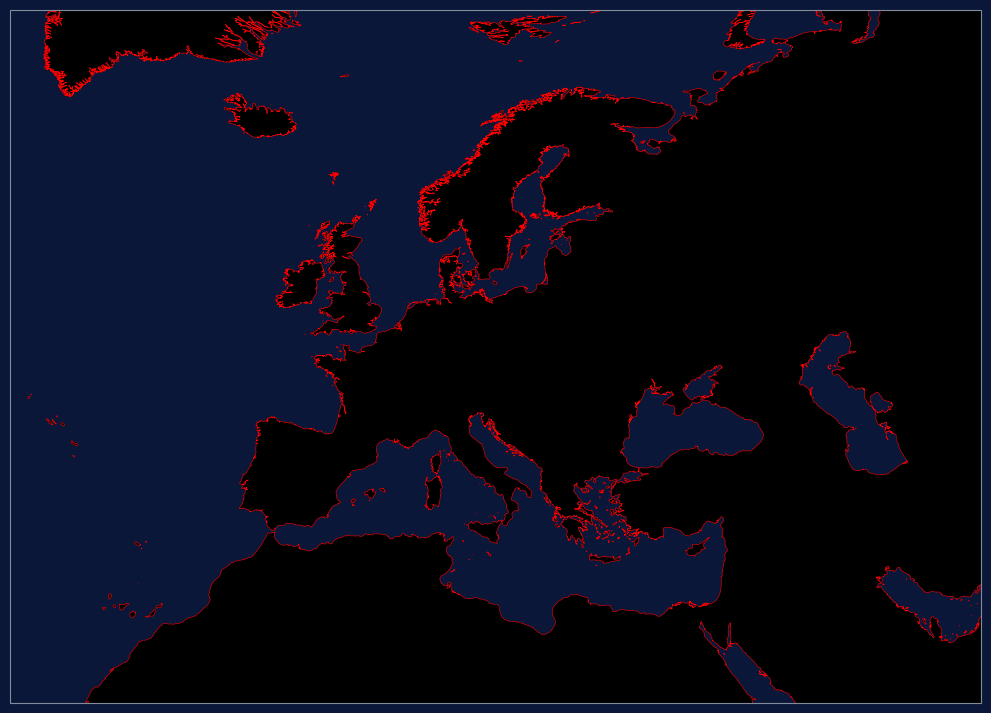
    


By default`psm.context` sets the background color of the figure to match the ocean color,
which means that the call to
`plt.figure` must occur inside the context block. To overide this, for example to set the figure
background to transparent, one could do:


```python
with psm.context(psm.styles.dark):
    with psm.context({"figure.facecolor" : (0, 0, 0, 0)}):
        fig = plt.figure(figsize=(16, 9))
        psm.create_map(projection="regional.european_union")
        psm.add_land()
```


    
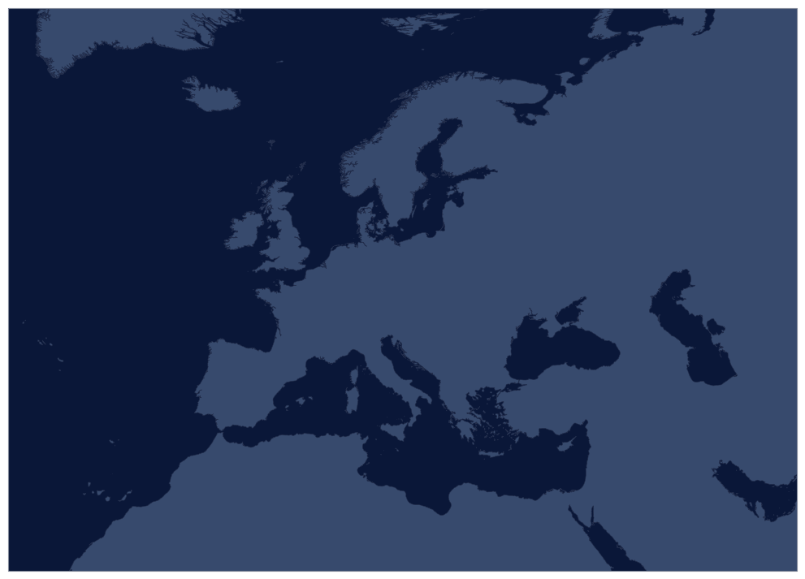
    


In some cases it's desirable to turn off the axes, for example if there is allready a contrasting background.
This can be done using `ax.spines['geo'].set_visible(False)`.


```python
with psm.context(psm.styles.dark):
    with psm.context({"figure.facecolor" : "grey"}):
        fig = plt.figure(figsize=(16, 9))
        ax = psm.create_map(projection="regional.european_union")
        psm.add_land()
        ax.spines['geo'].set_visible(False)
```


    

    


It is often convenient to set either the horizontal or vertical extent and have
the map fill the rest of the figure. This can done using `set_lon_extent` or
`set_lat_extent`.


```python
with psm.context(psm.styles.dark):
    fig = plt.figure(figsize=(16, 9))
    ax = psm.create_map(projection="regional.european_union")
    psm.add_land()
    psm.set_lon_extent(-25, 55, central_lat=50)
```

    Ignoring fixed y limits to fulfill fixed data aspect with adjustable data limits.


    

    


In addition to `add_land` there a number of other features that can be added to maps
including eezs, grid_lines, countries, logos, scalebar, etc. If you add a logo, without specifying
the image to use, you'll get the PySeas logo.


```python
with psm.context(psm.styles.light):
    fig = plt.figure(figsize=(18, 6))
    psm.create_map(projection="country.china")
    psm.add_land()
    psm.add_countries(facecolor=(0, 0, 0, 0))
    psm.add_eezs()
    psm.add_gridlines()
    psm.add_gridlabels()
    psm.add_logo(loc="upper left")
    psm.add_scalebar()
```


    

    


When displaying EEZs, it may be useful to exclude the "Straight Baseline".


```python
with psm.context(psm.styles.light):
    fig = plt.figure(figsize=(18, 6))
    psm.create_map(projection="country.china")
    psm.add_land()
    psm.add_countries(facecolor=(0, 0, 0, 0))
    psm.add_eezs(exclude={"Straight Baseline"})
    psm.add_gridlines()
    psm.add_gridlabels()
    psm.add_logo(loc="upper left")
```


    

    


```python
eezs = psm.core._eezs
[key] = eezs.keys()
eez = eezs[key]
eez.LINE_TYPE.unique()
```


    array(['Unsettled median line', 'Treaty', 'Joint regime',
           'Unilateral claim (undisputed)', 'Unsettled', '200 NM',
           'Connection line', 'Median line', 'Straight Baseline',
           'Archipelagic Baseline'], dtype=object)


More commonly you'll want to either specify a custom logo as shown here, or set the default
logo as shown below.


```python
light_logo = skimage.io.imread("../data/logos/picc_black.png")

with psm.context(psm.styles.light):
    fig = plt.figure(figsize=(18, 6))
    psm.create_map(projection="country.china")
    psm.add_land()
    psm.add_countries()
    psm.add_eezs()
    psm.add_gridlines()
    psm.add_gridlabels()
    psm.add_logo(light_logo, loc="lower right", scale=0.2)
```


    

    


`set_default_logos` accepts Google Cloud Storage paths prefixed with
either `gs://` or `gcs://`. Logos loaded this way are locally cached.
For example, if your logos are located at `gs://pyseas/logos/`, you can
use the following:


```python
psm.styles.set_default_logos(
    light_logo="gs://pyseas/logos/logo_black.png",
    dark_logo="gs://pyseas/logos/logo_white.png",
    scale_adj=1.0,
    alpha=0.5,
)

with psm.context(psm.styles.dark):
    fig = plt.figure(figsize=(18, 6))
    psm.create_map(projection="country.china")
    psm.add_land()
    psm.add_countries()
    psm.add_eezs()
    psm.add_gridlines()
    psm.add_gridlabels()
    psm.add_logo(loc="lower right")
```


    

    


If region is not specified, you get the default global map as specified by the
projection name `global.default`. Currently that's ExactEarth centered at 0 longitude.


```python
with psm.context(psm.styles.light):
    fig = plt.figure(figsize=(18, 6))
    psm.create_map()
    psm.add_land()
    psm.add_countries()
    psm.add_eezs()
    psm.add_gridlines()
    # Note gridlabels don't currently work on global maps
```


    
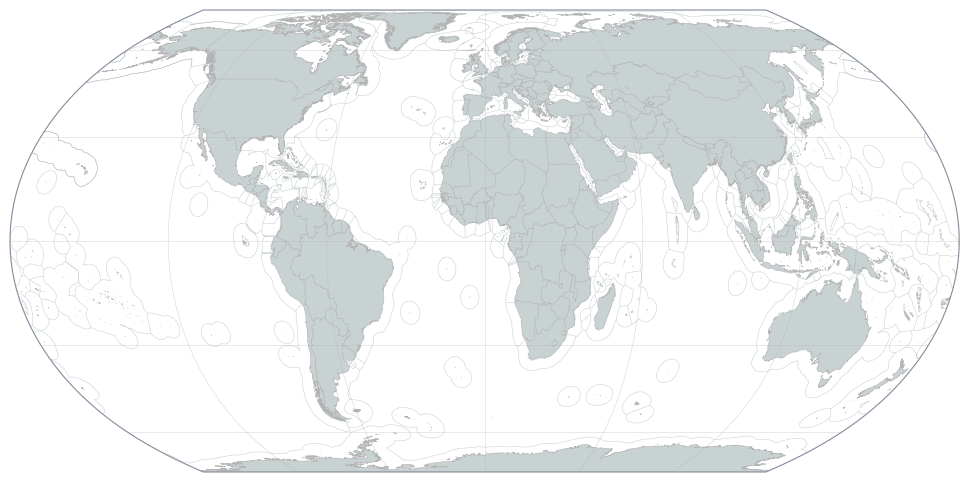
    


```python
# If you don't need to show the Mediterraean, you can show the major oceans
# with the "global.pacific_157w" projection
with psm.context(psm.styles.light):
    fig = plt.figure(figsize=(18, 6))
    psm.create_map(projection="global.pacific_157w")
    psm.add_land(facecolor="black")
    psm.add_countries()
    psm.add_eezs()
    psm.add_gridlines()
```


    

    


## Rasters

There are facilities for creating and displaying rasters.


```python
# # Grab some data and create a raster
seismic_presence = pd.read_csv(data_dir / "seismic_presence_tenth_degree.csv.zip")
seismic_raster = psm.rasters.df2raster(
    seismic_presence,
    "lon_index",
    "lat_index",
    "hours",
    xyscale=10,
    origin="lower",
    per_km2=True,
)
```


```python
import pandas as pd
from pathlib import Path
data_dir = Path("..") / "doc" / "data"
seismic_raster.shape
```


    (1800, 3600)


```python
from matplotlib.gridspec import GridSpec
import numpy as np
import matplotlib.pyplot as plt
import matplotlib.colors as mpcolors
import cartopy
import pyseas.maps as psm

with psm.context(psm.styles.light):
    dummy_raster = np.zeros((1800, 3600))

    fig = plt.figure(figsize=(14, 6.5 * 3), tight_layout=True)

    grid1 = GridSpec(
        2,
        2,
        height_ratios=[1.05, 0.95],
        top=1,
        bottom=0.35,
        wspace=0.01,
        hspace=0.015,
        left=0.01,
        right=0.98,
    )

    sub2 = grid1[(1, 0)]
    sub3 = grid1[(1, 1)]

    count = 0

    for sub, raster in zip([sub2, sub3], [dummy_raster, dummy_raster]):

        xc, yc, dx_x_2 = (5.0, 56.3, 10.5)  # x, y, zoom
        dx = dx_x_2 / 2
        extent = (xc - dx, xc + dx, yc - dx, yc + dx)

        prj = cartopy.crs.LambertAzimuthalEqualArea(xc, yc)
        ax = psm.create_map(subplot=sub, projection=prj)

        ax.set_extent(extent, crs=psm.identity)
        ax.set_adjustable("datalim")
        psm.add_land(ax=ax, color="0.8")

        norm = mpcolors.LogNorm(vmin=1e-2, vmax=1e2)

        im = psm.add_raster(
            raster,
            ax=ax,
            cmap="YlGnBu",
            norm=norm,
            origin="lower",
        )

        if count == 0:
            ax.text(
                0.97,
                -0.066,
                "Hours of vessel activity per km$^2$",
                ha="right",
                color="k",
                fontsize=16,
                transform=ax.transAxes,
            )
        elif count == 1:
            cb = psm.add_colorbar(
                im,
                ax=ax,
                label="",
                loc="bottom",
                width=1,
                height=0.03,
                hspace=0.04,
                wspace=0.016,
                valign=0.5,
                right_edge=None,
                center=False,
            )
        count += 1

```

    Ignoring fixed x limits to fulfill fixed data aspect with adjustable data limits.
    Ignoring fixed x limits to fulfill fixed data aspect with adjustable data limits.
    /Users/timothyhochberg/miniforge3/envs/pyseas-test/lib/python3.11/site-packages/IPython/core/events.py:82: UserWarning: This figure includes Axes that are not compatible with tight_layout, so results might be incorrect.
      func(*args, **kwargs)
    /Users/timothyhochberg/miniforge3/envs/pyseas-test/lib/python3.11/site-packages/IPython/core/pylabtools.py:170: UserWarning: This figure includes Axes that are not compatible with tight_layout, so results might be incorrect.
      fig.canvas.print_figure(bytes_io, **kw)


    
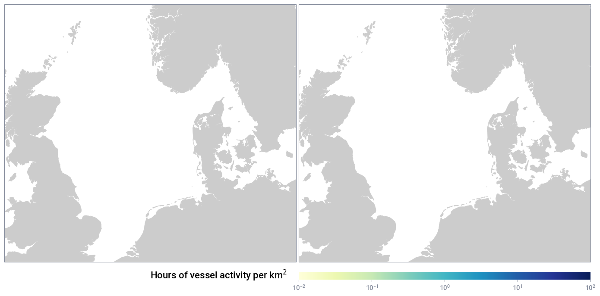
    


```python
norm = mpcolors.LogNorm(vmin=0.001, vmax=10)
with psm.context(psm.styles.dark):
    fig = plt.figure(figsize=(14, 7))
    ax, im = psm.plot_raster(
        seismic_raster,
        projection="country.indonesia",
        cmap="presence",
        norm=norm,
        origin="lower",
    )
    psm.add_countries()
    psm.add_eezs()
    ax.set_title("Seismic Vessel Presence Near Indonesia")
    fig.colorbar(
        im,
        ax=ax,
        orientation="horizontal",
        fraction=0.02,
        aspect=40,
        pad=0.04,
    )
```


    
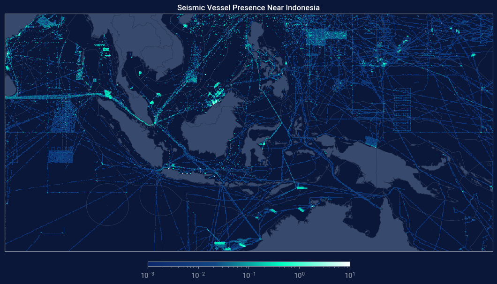
    


`add_colorbar` can be used with subplots. Here we just plot the same
thing twice and add a colorbar to the last plot.


```python
norm = mpcolors.LogNorm(vmin=0.001, vmax=10)
gs = gridspec.GridSpec(2, 1)
with psm.context(psm.styles.dark):
    with psm.context({"text.color": "white"}):
        fig = plt.figure(figsize=(14, 14))
        for i in range(2):
            ax, im = psm.plot_raster(
                seismic_raster,
                subplot=gs[i, 0],
                projection="country.indonesia",
                cmap="presence",
                norm=norm,
                origin="lower",
            )
            ax.set_title(f"Seismic Vessel Presence Near Indonesia - {i + 1}")
        psm.add_colorbar(im, label=r"hours per $\mathregular{km^2}$ ")
```


    

    


```python
norm = mpcolors.LogNorm(vmin=0.001, vmax=10)
gs = gridspec.GridSpec(2, 2, hspace=0, wspace=0.02)
with psm.context(psm.styles.dark):
    with psm.context({"text.color": (0.5, 0.5, 0.5)}):
        fig = plt.figure(figsize=(14.7, 7.6))
        for i in range(2):
            for j in range(2):
                ax, im = psm.plot_raster(
                    seismic_raster,
                    subplot=gs[i, j],
                    projection="country.indonesia",
                    cmap="presence",
                    norm=norm,
                )
        cbax = psm.add_left_labeled_colorbar(
            im,
            ax=ax,
            label=r"hours per $\mathregular{km^2}$",
            width=1.7,
            height=0.035,
            wspace=0.0025,
            valign=0.2,
            ticks=[2e-3, 2e-2, 2e-1, 2],
            formatter="%4.e"
        )
```


    

    


```python
# Display a raster along with standard colorbar.
norm = mpcolors.LogNorm(vmin=0.001, vmax=10)
with psm.context(psm.styles.dark), psm.context({"xtick.labelsize": 20}):
        fig = plt.figure(figsize=(14, 7))
        ax, im = psm.plot_raster(
            seismic_raster,
            projection="country.indonesia",
            cmap="presence",
            norm=norm,
            origin="lower",
        )
        cbax = psm.add_colorbar(im, label=r"hours per $\mathregular{km^2}$", width=0.5)
        ax.images[-1].colorbar.minorticks_off()
```


    

    


If a grid of maps using the same projection is being plotted, one can instead
use `create_maps`, which mirrors the interface of `plt.subplots`


```python
norm = mpcolors.LogNorm(vmin=0.001, vmax=10)
with plt.rc_context(psm.styles.dark):
    fig, axes = psm.create_maps(
        2, 2, projection="country.indonesia", figsize=(14.7, 7.6)
    )
    with psm.context({"text.color": (0.5, 0.5, 0.5)}):
        for row in axes:
            for ax in row:
                im = psm.add_raster(
                    seismic_raster, ax=ax, cmap="presence", norm=norm, origin="lower"
                )
        psm.add_colorbar(
            im,
            ax=ax,
            label=r"hours per $\mathregular{km^2}$",
            width=1.7,
            height=0.035,
            wspace=0.0025,
            valign=0.2,
        )

        plt.subplots_adjust(hspace=0, wspace=0.02)
```


    

    


```python
# Display a raster along with standard colorbar.
norm = mpcolors.LogNorm(vmin=0.001, vmax=10)
with psm.context(psm.styles.dark):
    fig = plt.figure(figsize=(14, 7))
    with psm.context({"text.color": "white"}):
        fig, ax = psm.create_maps(projection="country.indonesia", figsize=(14.7, 7.6))
        psm.add_raster(seismic_raster, cmap="presence", norm=norm, origin="lower")
        psm.add_colorbar(im, label=r"hours per $\mathregular{km^2}$", loc="bottom")
```

    /Users/timothyhochberg/Documents/GlobalFishingWatch/GFW-Code/mapping-projects/pyseas/pyseas/maps/colorbar.py:74: UserWarning: Adding colorbar to a different Figure <Figure size 1470x760 with 4 Axes> than <Figure size 1470x760 with 1 Axes> which fig.colorbar is called on.
      cb = plt.colorbar(


    <Figure size 1400x700 with 0 Axes>


    

    


If you want to make sure to fill the space in the subplots without fiddling with
the projections, you can use `ax.set_adjustable("datalim")`.

The recipe below plots multiple plots with different locations and zoom levels on
different GridSpecs and fills in each plot.


```python
proj_info = [  # lon_center, lat_center, approximate_size in degrees
    [(120.0, 0.0, 20.0), (140.99, 37.82, 10.0)],
    [(-85.0, -2.50, 12.0), (-80.0, -34.63, 20)],
    [(120.0, 0.0, 13.5), (-80.0, 6.50, 4.0)],
]

gspecs = [[(0, slice(0, 2)), (slice(0, 2), 2)],
          [(1, 0), (1, 1)],
          [(2, slice(0, 2)), (2, 2)]]

norm = mpcolors.LogNorm(vmin=0.001, vmax=10)
gs = gridspec.GridSpec(3, 3)
with psm.context(psm.styles.dark):
    with psm.context({"text.color": "white"}):
        fig = plt.figure(figsize=(14, 14))
        for i in range(3):
            for j in range(2):
                xc, yc, dx_x_2 = proj_info[i][j]
                dx = dx_x_2 / 2
                prj = cartopy.crs.LambertAzimuthalEqualArea(xc, yc)
                ax = psm.create_map(subplot=gs[gspecs[i][j]], projection=prj)
                psm.add_raster(seismic_raster, norm=norm, origin="lower")
                psm.add_land()
                ax.set_extent((xc - dx, xc + dx, yc - dx, yc + dx), crs=psm.identity)
                ax.set_adjustable("datalim")
```

    Ignoring fixed x limits to fulfill fixed data aspect with adjustable data limits.
    Ignoring fixed y limits to fulfill fixed data aspect with adjustable data limits.
    Ignoring fixed x limits to fulfill fixed data aspect with adjustable data limits.
    Ignoring fixed x limits to fulfill fixed data aspect with adjustable data limits.


    

    


```python
proj_info = [  # lon_center, lat_center, approximate_size in degrees
    [(120.0, 0.0, 20.0), (140.99, 37.82, 10.0)],
    [(-85.0, -2.50, 12.0), (-80.0, -34.63, 20)],
    [(120.0, 0.0, 13.5), (-80.0, 6.50, 4.0)],
]

gspecs = [[(0, slice(0, 2)), (slice(0, 2), 2)],
          [(1, 0), (1, 1)],
          [(2, slice(0, 2)), (2, 2)]]

norm = mpcolors.LogNorm(vmin=0.001, vmax=10)
gs = gridspec.GridSpec(3, 3)
with psm.context(psm.styles.dark):
    with psm.context({"text.color": "white"}):
        fig = plt.figure(figsize=(14, 14))
        for i in range(3):
            for j in range(2):
                xc, yc, dx_x_2 = proj_info[i][j]
                dx = dx_x_2 / 2
                prj = cartopy.crs.LambertAzimuthalEqualArea(xc, yc)
                ax = psm.create_map(subplot=gs[gspecs[i][j]], projection=prj)
                psm.add_raster(seismic_raster, norm=norm, origin="lower")
                psm.add_land()
                ax.set_extent((xc - dx, xc + dx, yc - dx, yc + dx), crs=psm.identity)
                ax.set_adjustable("datalim")
plt.tight_layout()
```

    Ignoring fixed x limits to fulfill fixed data aspect with adjustable data limits.
    Ignoring fixed y limits to fulfill fixed data aspect with adjustable data limits.
    Ignoring fixed x limits to fulfill fixed data aspect with adjustable data limits.
    Ignoring fixed x limits to fulfill fixed data aspect with adjustable data limits.
    Ignoring fixed y limits to fulfill fixed data aspect with adjustable data limits.
    Ignoring fixed x limits to fulfill fixed data aspect with adjustable data limits.
    Ignoring fixed y limits to fulfill fixed data aspect with adjustable data limits.
    Ignoring fixed y limits to fulfill fixed data aspect with adjustable data limits.


    

    


### H3 Discrete Global Grids

There is also support for rendering data defined in terms of H3 DGG as rasters

N.B. this relies on `h3.unstable`, so might require modification to work in the future.


```python
fishing_h3_6 = pd.read_csv(data_dir / "fishing_h3_lvl6.csv.zip")
h3cnts_6_b = {np.uint64(int(x.h3, 16)): x.cnt for x in fishing_h3_6.itertuples()}
```


```python
norm = mpcolors.LogNorm(1, 40000)
with psm.context(psm.styles.dark):
    fig = plt.figure(figsize=(14, 7))
    ax, im = psm.plot_h3_data(
        h3cnts_6_b,
        projection=cartopy.crs.LambertAzimuthalEqualArea(
            central_longitude=10, central_latitude=60
        ),
        extent=(3.8, 25.0, 65.0, 75.4),
        cmap="presence",
        norm=norm,
        show_land=False
    )
    psm.add_land(facecolor="black", edgecolor="black")
    psm.add_countries()
    psm.add_eezs()
    ax.set_title("H3 data example")
    psm.add_colorbar(im, width=1.0)
    # Or
    plt.colorbar(
        im,
        ax=ax,
        orientation="vertical",
        fraction=0.02,
        aspect=40,
        pad=0.04,
    )
```


    

    


## Plotting Tracks

There are two base functions for plotting vessel tracks. `maps.plot` is
a simple wrapper around `plt.plot` that plots tracks specified in lat/lon,
but is otherwise identical `plt.plot`. The alternative, `maps.add_plot` can plot plot tracks
with multiple subsegments, using different styles for each subsegment.

Both of these support creation of legends. However, the second requires a bit
of manual intervention.


```python
position_msgs = pd.read_csv(data_dir / "position_messages.csv.zip")
position_msgs["timestamp"] = pd.to_datetime(position_msgs.timestamp)
```

Note the use of `maps.find_projection` to find an appropriate projection and extents
based on lat/lon data.


```python
# Simple track plotting analogous to plt.plot
with psm.context(psm.styles.light):
    fig = plt.figure(figsize=(8, 8))
    df = position_msgs[position_msgs.seg_id == "249014000-2018-01-21T16:36:23.000000Z"]
    proj = psm.find_projection(df.lon, df.lat)
    psm.create_map(projection=proj)
    psm.add_land()

    psm.plot(df.lon.values, df.lat.values, label="first")
    psm.plot(df.lon.values, df.lat.values + 0.1, label="second")
    psm.plot(
        df.lon.values - 0.3, df.lat.values, color="purple", linewidth=3, label="third"
    )

    plt.legend()
```


    
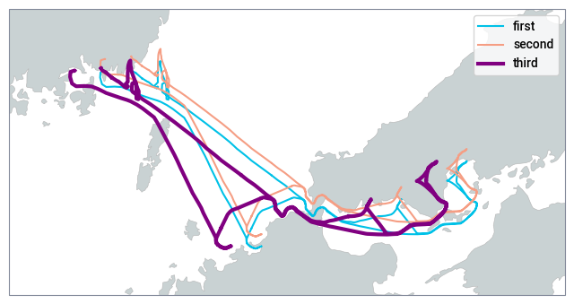
    


```python
# The track extent is padded using `pad_abs` and `pad_rel`. This works
# even when the extent is zero
with psm.context(psm.styles.light):
    fig = plt.figure(figsize=(8, 8))
    df = position_msgs[position_msgs.seg_id == "249014000-2018-01-21T16:36:23.000000Z"]
    df = df.iloc[:1]
    proj = psm.find_projection(df.lon, df.lat)
    psm.create_map(projection=proj)
    psm.add_land()

    psm.plot(df.lon.values, df.lat.values, label="first")
    psm.plot(df.lon.values, df.lat.values + 0.1, label="second")
    psm.plot(
        df.lon.values - 0.3, df.lat.values, color="purple", linewidth=3, label="third"
    )

    plt.legend()
```


    
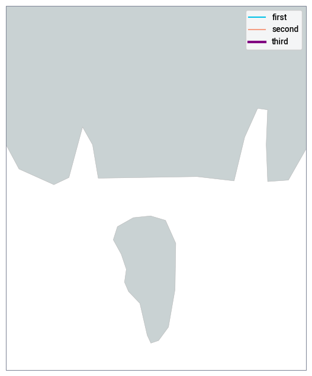
    


One can use `add_plot` to display multiple plots at once or to display a single
plot with multiple states. In the first case one uses `break_on_change=False` and
in the second `break_on_change=True`. In either case, the value of the `props`
argument controls the color of plotted line segments. `break_on_change` controls
how whether lines with a given `props` values are broken when the value changes.


```python
# Use add plot, to display multiple tracks at once.
with psm.context(psm.styles.light):
    fig = plt.figure(figsize=(8, 8))
    df = position_msgs[position_msgs.ssvid != 220413000]
    projname = psm.find_projection(df.lon, df.lat)
    psm.create_map(projection=projname)
    psm.add_land()
    handles = psm.add_plot(
        df.lon.values, df.lat.values, df.ssvid, break_on_change=False
    )
    plt.legend(handles.values(), handles.keys())
```


    

    


```python
# Use add plot, to display tracks with multiple values
# this simple example leaves gaps between the segments
# Generating an appropriate set of props is a bit tricky --
# here we use the built in fishing props.
with psm.context(psm.styles.light):
    fig = plt.figure(figsize=(8, 8))
    df = position_msgs[position_msgs.ssvid == 413461490]
    projinfo = psm.find_projection(df.lon, df.lat)
    psm.create_map(projection=projinfo.projection, extent=projinfo.extent)
    psm.add_land()
    handles = psm.add_plot(
        df.lon.values,
        df.lat.values,
        df.speed > 7,
        break_on_change=True,
        props=psm.styles._fishing_props,
    )
    plt.legend(handles.values(), ["speed <= 7 knots", "speed > 7 knots"])
```


    

    


## Panels

There are a couple of convenience functions that package up add_plot
for a couple of common cases. These also support adding subsidiary
time/other-parameter plots and both functions will automatically choses
and appropriate projection and extents based on the input data
using `maps.find_projection`.

The first of these `multi_track_panel` is specialized for plotting multiple
tracks at once.


```python
df = position_msgs[(position_msgs.ssvid == 413461490)]
with psm.context(psm.styles.panel):
    fig = plt.figure(figsize=(12, 12))
    info = psc.multi_track_panel(
        df.timestamp,
        df.lon,
        df.lat,
        df.seg_id,
        plots=[{"label": "lon", "values": df.lon}, {"label": "lat", "values": df.lat}],
    )
    plt.legend(
        info.legend_handles.values(),
        [x.split("-", 1)[1].rstrip(".000000000Z") for x in info.legend_handles.keys()],
    )

# There is some basic functionality for combining multiple panels as shown below.
```


    

    


```python
df = position_msgs[(position_msgs.ssvid == 413461490)]
with psm.context(psm.styles.panel):
    fig = plt.figure(figsize=(18, 18))
    gs = gridspec.GridSpec(2, 2)

    psc.multi_track_panel(
        df.timestamp,
        df.lon,
        df.lat,
        df.seg_id,
        plots=[{"label": "lon", "values": df.lon}, {"label": "lat", "values": df.lat}],
        gs=gs[0, 0],
        label_angle=-30,
    )

    psc.multi_track_panel(
        df.timestamp,
        df.lon,
        df.lat,
        df.seg_id,
        plots=[{"label": "lon", "values": df.lon}, {"label": "lat", "values": df.lat}],
        gs=gs[0, 1],
        label_angle=30,
    )

    psc.multi_track_panel(
        df.timestamp,
        df.lon,
        df.lat,
        df.seg_id,
        plots=[{"label": "lon", "values": df.speed}],
        gs=gs[1, 0],
        label_angle=30,
    )

    psc.multi_track_panel(
        df.timestamp,
        df.lon,
        df.lat,
        df.seg_id,
        plots=[{"label": "lon", "values": df.speed}],
        gs=gs[1, 1],
        label_angle=30,
    )
```


    
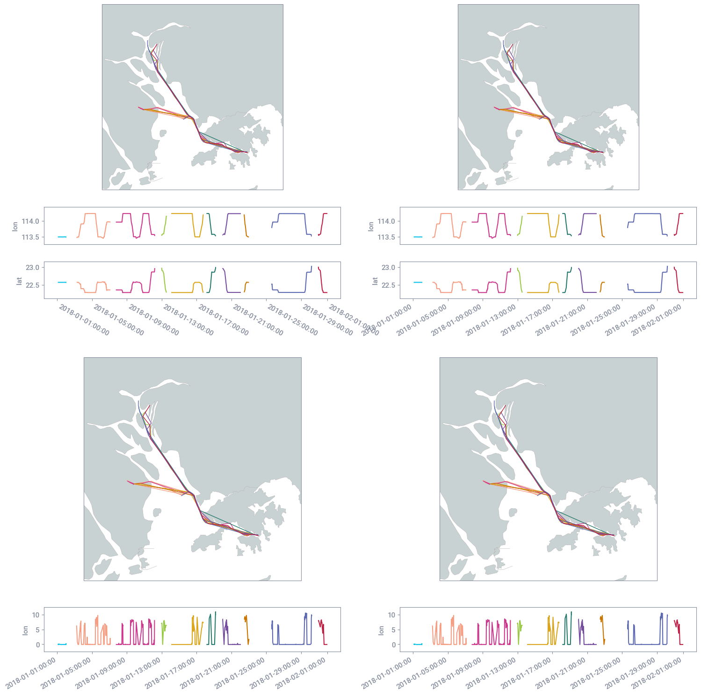
    


```python
df = position_msgs[(position_msgs.ssvid == 413461490)]
with psm.context(psm.styles.panel):
    fig = plt.figure(figsize=(18, 18))
    gs = gridspec.GridSpec(1, 2, figure=fig)

    psc.multi_track_panel(
        df.timestamp,
        df.lon,
        df.lat,
        df.seg_id,
        plots=[{"label": "lon", "values": df.lon}, {"label": "lat", "values": df.lat}],
        gs=gs[0],
    )

    psc.multi_track_panel(
        df.timestamp,
        df.lon,
        df.lat,
        df.seg_id,
        plots=[{"label": "lon", "values": df.lon}, {"label": "lat", "values": df.lat}],
        gs=gs[1],
    )
```


    
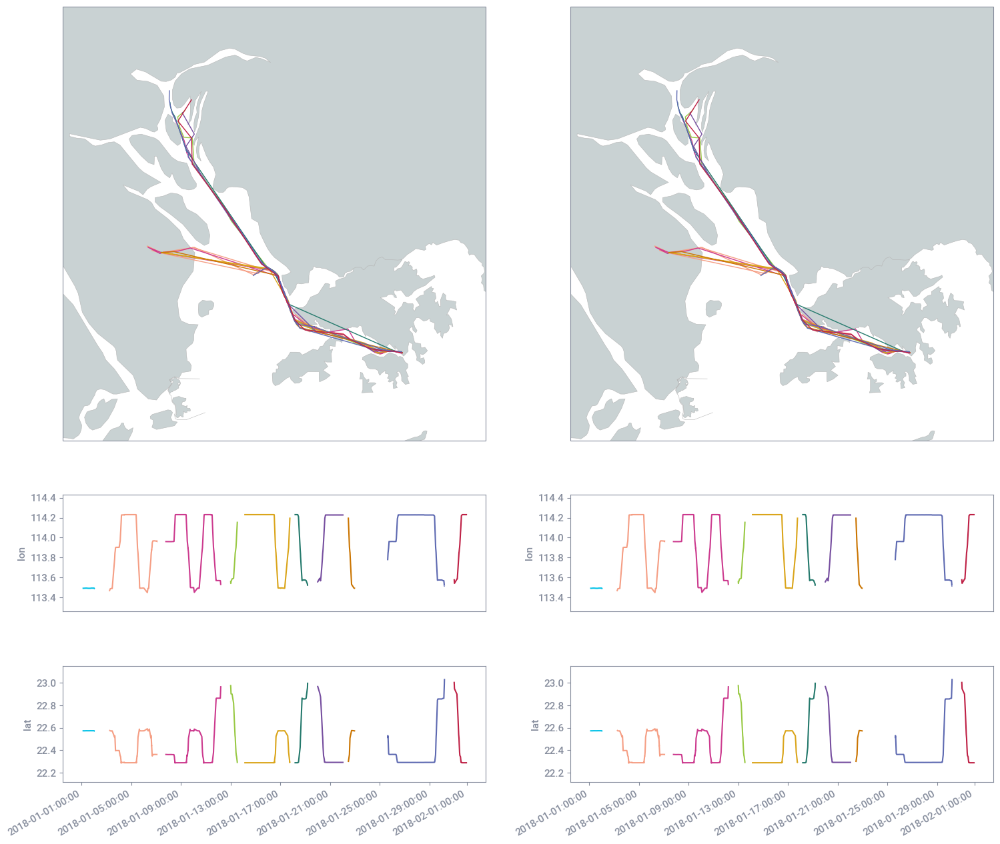
    


The second panel type, `track_state_panel`, plots single tracks with multiple states. For instance,
fishing/non-fishing, loitering/non-loitering, etc.


```python
df = position_msgs[(position_msgs.ssvid == 413461490)].reset_index()
with psm.context(psm.styles.panel):
    fig = plt.figure(figsize=(12, 12))
    info = psc.track_state_panel(
        df.timestamp,
        df.lon,
        df.lat,
        df.speed > 7.0,
        plots=[{"label": "speed (knots)", "values": df.speed, "min_y": 0}],
    )
```


    
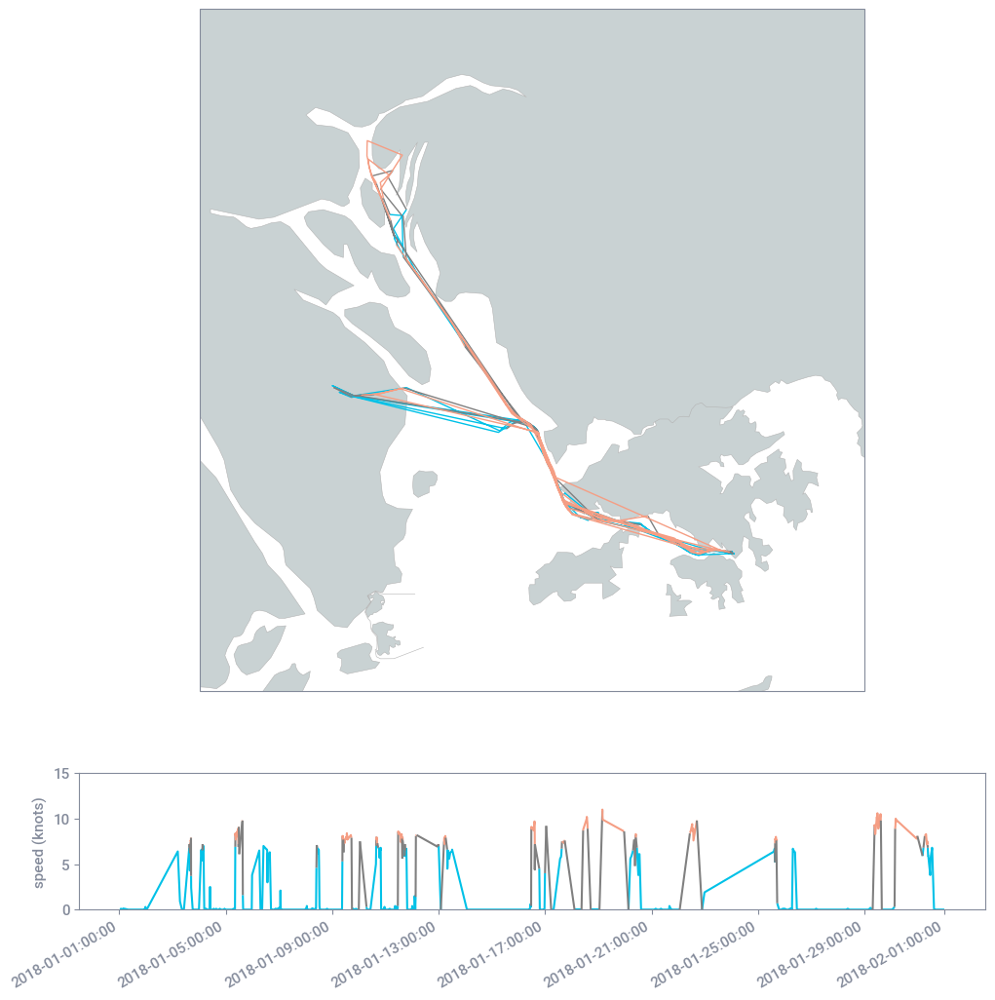
    


Both panel types have a number of options including `annotations` and
`add_night_shades`.


```python
df = position_msgs[(position_msgs.ssvid == 413461490)].reset_index()
with psm.context(psm.styles.panel):
    fig = plt.figure(figsize=(12, 12))
    info = psc.track_state_panel(
        df.timestamp,
        df.lon,
        df.lat,
        df.speed > 7.0,
        annotations=5,
        add_night_shades=True,
        plots=[{"label": "speed (knots)", "values": df.speed, "min_y": 0}],
    )
```


    

    


## Miniglobe

The miniglobe gets its own section by virtue of being one of the most complex
pieces internally, despite its relative outward simplicity. The miniglobe can
be specified to either have an AOI indicated or a marker at the specified location.


```python
with psm.context(psm.styles.dark):
    fig = plt.figure(figsize=(10, 10))
    ax = psm.create_map(projection="country.indonesia")
    psm.add_land(ax)
    psm.add_countries(ax)
    psm.add_miniglobe(loc="upper left")
    plt.show()
```


    
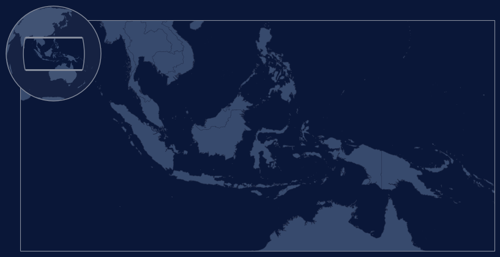
    


```python
with psm.context(psm.styles.dark):
    fig = plt.figure(figsize=(10, 10))
    ax = psm.create_map(projection="country.indonesia")
    psm.add_land(ax)
    psm.add_countries(ax)
    psm.add_miniglobe(loc="lower right", central_marker="*")
    plt.show()
```


    

    


## Plotting Gaps

See `PlotGap.ipynb` [locally](contrib/PlotGap.ipynb) or on
[github](https://github.com/GlobalFishingWatch/rendered/blob/master/pyseas/pyseas/doc/contrib/PlotGap.ipynb)

## Bivariate Rasters

There is basic support for Bivariate plots, although only TransparencyBivariateColormap
has been significantly tested at this time. Works for both dark and light themes.


```python
df = pd.read_csv("data/fishing_effort_known_vs_unknown_2020_1deg.csv.zip")
df_all = df[df["fishing_hours_all"].notnull()]
df_known = df[df["fishing_hours_known_vessels"].notnull()]

grid_known = psm.rasters.df2raster(
    df_known,
    "lon_bin",
    "lat_bin",
    "fishing_hours_known_vessels",
    xyscale=1,
    per_km2=True,
)
grid_total = psm.rasters.df2raster(
    df_all, "lon_bin", "lat_bin", "fishing_hours_all", xyscale=1, per_km2=True
)
grid_ratio = np.divide(
    grid_known, grid_total, out=np.zeros_like(grid_known), where=grid_total != 0
)
```


```python
cmap = psm.cm.bivariate.TransparencyBivariateColormap(psm.cm.bivariate.orange_blue)
with psm.context(psm.styles.dark):
    fig = plt.figure(figsize=(15, 15))
    ax = psm.create_map()
    psm.add_land(ax)

    norm1 = mpcolors.Normalize(vmin=0.0, vmax=1.0, clip=True)
    norm2 = mpcolors.LogNorm(vmin=0.01, vmax=10, clip=True)

    psm.add_bivariate_raster(
        grid_ratio, np.clip(grid_total, 0.01, 10), cmap, norm1, norm2
    )

    cb_ax = psm.add_bivariate_colorbox(
        cmap,
        norm1,
        norm2,
        xlabel="fraction of matched fishing hours",
        ylabel="total fishing hours",
        yformat="{x:.2f}",
        aspect_ratio=2.0,
    )
```


    

    


Rather than a colorbox, we can also add a colorbar, since the transparent axis is
often not that informative.


```python
cmap = psm.cm.bivariate.TransparencyBivariateColormap(psm.cm.bivariate.orange_blue)
with psm.context(psm.styles.light):
    fig = plt.figure(figsize=(15, 15), facecolor="white")
    ax = psm.create_map()
    psm.add_land(ax)

    norm1 = mpcolors.Normalize(vmin=0.0, vmax=1.0, clip=True)
    norm2 = mpcolors.LogNorm(vmin=0.01, vmax=10, clip=True)

    img = psm.add_bivariate_raster(
        grid_ratio, np.clip(grid_total, 0.01, 10), cmap, norm1, norm2
    )

    img.set_cmap(cmap.cmap)
    psm.add_top_labeled_colorbar(
        img,
        left_label=r"$\longleftarrow$ less matched",
        center_label=r"AIS$\leftrightarrow$registries",
        right_label=r"more matched $\longrightarrow$",
    )
```


    

    


This works nicely with a discretized coloramp, which be be realized using
`Boundary


```python
def make_red_green_blue_ramp(L=0.5, min_S_l=0.4, name="red_blue_bv", n=255):
    colors = []
    hues = np.linspace(0, 0.666, n, endpoint=True)
    sats = min_S_l + (1 - min_S_l) * abs(np.linspace(-1, 1, n, endpoint=True))
    for H, S_l in zip(hues, sats):
        V = L + S_l * min(L, 1 - L)
        S_v = 2 * (1 - L / V)
        colors.append(mpcolors.hsv_to_rgb((H, S_v, V)))
    return mpcolors.LinearSegmentedColormap.from_list(name, colors)


def piecewise_constant_color_map(colors, name="pccm"):
    """colors is list[tuple(float, float, float)]"""
    breaks = np.linspace(0, 1.0, len(colors) + 1, endpoint=True)
    arg = {"red": [], "green": [], "blue": []}
    last_clr = colors[0]
    colors = colors + [colors[-1]]
    for i, clr in enumerate(colors):
        arg["red"].append((breaks[i], last_clr[0], clr[0]))
        arg["green"].append((breaks[i], last_clr[1], clr[1]))
        arg["blue"].append((breaks[i], last_clr[2], clr[2]))
        last_clr = clr
    return mpcolors.LinearSegmentedColormap(name, arg)

red_blue = piecewise_constant_color_map([(1.0, 0.0, 0.0), (1.0, 0.5, 0.5),
                                        (0.5, 0.5, 1.0), (0.0, 0.0, 1.0)])
```


```python
red_blue = make_red_green_blue_ramp(min_S_l=0.1)

colors = [(1.0, 0.0, 0.0), (0.7, 0.0, 0.7), (0.0, 0.0, 1.0)]
red_blue = piecewise_constant_color_map(colors)


with psm.context(psm.styles.light):
    fig = plt.figure(figsize=(15, 15), facecolor="white")
    ax = psm.create_map()
    psm.add_land(ax)

    bounds = np.linspace(0, 1.0, len(colors) + 1, endpoint=True)
    cmap = psm.cm.bivariate.TransparencyBivariateColormap(red_blue)
    norm1 = mpcolors.BoundaryNorm(bounds, cmap.cmap.N, clip=True)
    norm2 = mpcolors.LogNorm(vmin=0.01, vmax=10, clip=True)

    img = psm.add_bivariate_raster(
        grid_ratio,
        np.clip(grid_total, 0.01, 10),
        cmap,
        norm1,
        norm2,
    )

    psm.add_top_labeled_colorbar(
        img,
        left_label=r"$\longleftarrow$ less matched",
        center_label=r"AIS$\leftrightarrow$registries",
        right_label=r"more matched $\longrightarrow$",
    )
```


    
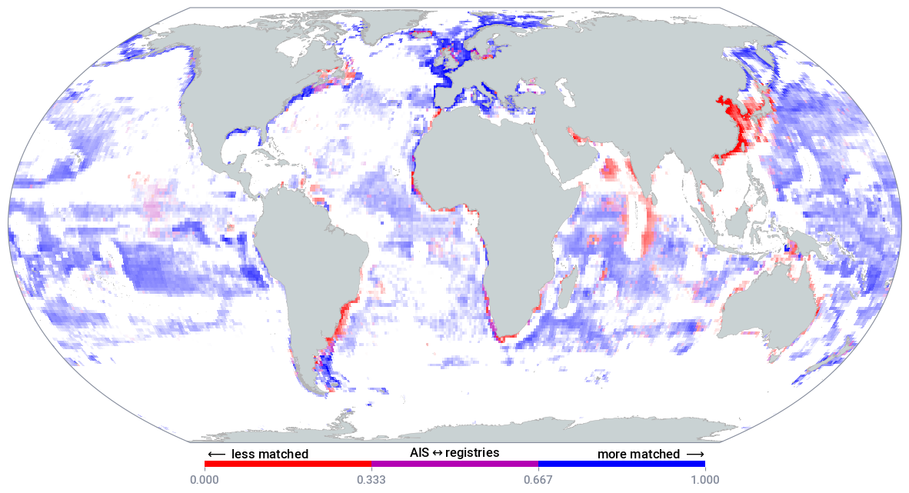
    


## Polar Plots

These are easier to plot using H3 than lat/lon grids, since H3 doesn't
have singularities at the poles.

First get some data using a query similar to:

     with h3_data as (
       select jslibs.h3.ST_H3(ST_GEOGPOINT(lon, lat), {level}) h3_n
       from DATASET.TABLE
       where lon between -180 and 180 and lat < 0
       and date(date) between "YYYY-MM-DD" and "YYYY-MM-DD"
     )

     select h3_n as h3, count(*) as cnt
     from h3_data
     group by h3_n

Then:


```python
polar_fishing_h3_7 = pd.read_csv("data/polar_fishing_h3_7.csv.zip")
polar_h3cnts_7 = {np.uint64(int(x.h3, 16)): x.cnt for x in polar_fishing_h3_7.itertuples()}

norm = mpcolors.LogNorm(1, 5000)
with psm.context(psm.styles.dark):
    fig = plt.figure(figsize=(14, 7))
    ax, im = psm.plot_h3_data(
        polar_h3cnts_7,
        projection=cartopy.crs.Stereographic(
            central_latitude=-90, central_longitude=0, true_scale_latitude=-70
        ),
        extent=(-180, 180, -30, -90),
        cmap="presence",
        norm=norm,
    )
    psm.add_countries()
    psm.add_eezs()
    ax.set_title("H3 data example")
    fig.colorbar(
        im,
        ax=ax,
        orientation="horizontal",
        fraction=0.02,
        aspect=40,
        pad=0.04,
    )
```


    

    


## Adding Polygons

If you are just adding a simple, unfilled polygon, you can add it using `ax.plot`. However,
if you need a filled polygon, you need to use `matlpotlib.patches.Polygon`


```python
# South China Sea extents according to Marine Regions
lon_min, lon_max = 102.2385, 122.1513
lat_min, lat_max = -3.2287, 25.5673

ll_corners = [
    (lon_min, lat_min),
    (lon_max, lat_min),
    (lon_max, lat_max),
    (lon_min, lat_max),
]
```


```python
# First plot using `ax.plot`

# When plotting a polygon using ax.plot, you need to include the first corner at the end
five_corners = ll_corners + ll_corners[:1]

with psm.context(psm.styles.light):
    fig = plt.figure(figsize=(18, 6))
    ax = psm.create_map(projection="country.china")
    psm.add_land()
    psm.add_countries()
    ax.plot(
        [x for (x, y) in five_corners],
        [y for (x, y) in five_corners],
        transform=psm.identity,
        zorder=0,
    )
    ax.set_extent(
        (lon_min - 5, lon_max + 5, lat_min - 5, lat_max + 5), crs=psm.identity
    )
```


    

    


```python
# Now using a Polygon
lons = np.array([x for (x, y) in five_corners])
lats = np.array([y for (x, y) in five_corners])

with psm.context(psm.styles.light):
    fig = plt.figure(figsize=(18, 6))
    ax = psm.create_map(projection="country.china")

    xformed = ax.projection.transform_points(psm.identity, lons, lats)[:, :2]
    xy = xformed[:4]

    rect = mppatches.Polygon(
        xy,
        linewidth=1,
        edgecolor="lime",
        facecolor=(0, 0, 0, 0.1),
        transform=ax.transData,
        zorder=0,
    )

    # You can also add an affine transform to the a Polygon
    # as well as controlling the z-order (higher numbers are
    # drawn on top)
    cntr = xy.sum(axis=0)
    xform = Affine2D().rotate_deg_around(*cntr, 20).scale(0.2)
    rotated = mppatches.Polygon(
        xy,
        linewidth=1,
        edgecolor="lime",
        facecolor=(0, 0, 1.0, 0.2),
        transform=xform + ax.transData,
        zorder=9,
    )

    psm.add_land()
    psm.add_countries()
    ax.set_extent(
        (lon_min - 5, lon_max + 5, lat_min - 5, lat_max + 5), crs=psm.identity
    )
    ax.add_patch(rect)
    ax.add_patch(rotated)
```


    

    


```python
# First plot using `ax.plot`

# When plotting a polygon using ax.plot, you need to include the first corner at the end
five_corners = ll_corners + ll_corners[:1]

with psm.context(psm.styles.light):
    fig = plt.figure(figsize=(18, 6))
    ax = psm.create_map(projection="country.china")
    psm.add_land()
    psm.add_countries()
    ax.plot(
        [x for (x, y) in five_corners],
        [y for (x, y) in five_corners],
        transform=psm.identity,
        zorder=0,
    )
    ax.set_extent(
        (lon_min - 5, lon_max + 5, lat_min - 5, lat_max + 5), crs=psm.identity
    )
```


    

    


```python
# Now using a Polygon
lons = np.array([x for (x, y) in five_corners])
lats = np.array([y for (x, y) in five_corners])

with psm.context(psm.styles.light):
    fig = plt.figure(figsize=(18, 6))
    ax = psm.create_map(projection="country.china")

    xformed = ax.projection.transform_points(psm.identity, lons, lats)[:, :2]
    xy = xformed[:4]

    rect = mppatches.Polygon(
        xy,
        linewidth=1,
        edgecolor="lime",
        facecolor=(0, 0, 0, 0.1),
        transform=ax.transData,
        zorder=0,
    )

    # You can also add an affine transform to the a Polygon
    # as well as controlling the z-order (higher numbers are
    # drawn on top)
    cntr = xy.sum(axis=0)
    xform = Affine2D().rotate_deg_around(*cntr, 20).scale(0.2)
    rotated = mppatches.Polygon(
        xy,
        linewidth=1,
        edgecolor="lime",
        facecolor=(0, 0, 1.0, 0.2),
        transform=xform + ax.transData,
        zorder=9,
    )

    psm.add_land()
    psm.add_countries()
    ax.set_extent(
        (lon_min - 5, lon_max + 5, lat_min - 5, lat_max + 5), crs=psm.identity
    )
    ax.add_patch(rect)
    ax.add_patch(rotated)
```


    

    


## Tiles


```python
downloader = pyseas.imagery.tiles.TileDownloader(
    server_url="https://storage.googleapis.com/public-tiles/basemap/bathymetry/{z}/{x}/{y}.png",
)

img, extent = downloader.download(extent=([123.65, 138.57, 34.22, 43.77]), zoom=6)

# Note that this is *just* bathymetry, so looks like open ocean
plt.imshow(img)

# Note that the final extent will typically be larger than input extent since the
# downloaded tiles are not trimmed
extent
```

    /Users/timothyhochberg/miniforge3/envs/pyseas-test/lib/python3.11/site-packages/osgeo/gdal.py:330: FutureWarning: Neither gdal.UseExceptions() nor gdal.DontUseExceptions() has been explicitly called. In GDAL 4.0, exceptions will be enabled by default.
      warnings.warn(


    (118.125, 146.25, 27.059125784374057, 45.089035564831015)


    
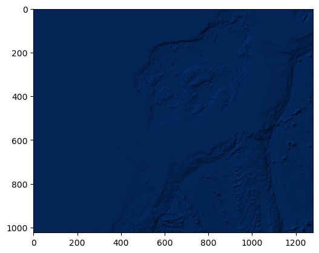
    


```python
# If the server needs authentication headers, you can specify the headers in the
# constructor:
server_url = "https://my/server/tile?x={x}&y={y}&z={z}"
api_token = "MY_TOKEN"

downloader =  pyseas.imagery.tiles.TileDownloader(
    server_url=server_url,
    headers= [("Authorization", f"Bearer {api_token}")],
    max_tiles=128,
)
```

## Night Tinting

It is sometimes convenient to plot the daytime image so that it look more like night.
Simply multiplying all the colors by by `[0.082, 0.365, 0.808]` does a surpisingly good
job. Note that this assumes that `img` is in floating point with range 0-1. If it's in
uint8 instead, with range 0-255, you'll need to divide by 255 as well.


```python
np.array([[[0.082, 0.365, 0.808, 1]]] )* [[[1.5, 1.5, 1.5, 1]]]
```


    array([[[0.123 , 0.5475, 1.212 , 1.    ]]])


```python
img = plt.imread("./data/world.png")
night_img = img * [[[0.082, 0.365, 0.808, 1]]]
night_img2 = img * [[[0.123 , 0.5475, 1.0 , 1.    ]]]
fig, (ax1, ax2, ax3) = plt.subplots(1, 3, figsize=(16, 8))
ax1.imshow(img)
ax1.axis('off')
ax2.imshow(night_img)
ax2.axis('off');
ax3.imshow(night_img2)
ax3.axis('off');
```


    

    


## Saving Plots

Plots can be saved in the normal way, using `plt.savefig`. If a background is needed,
the standard facecolor can be applied as shown below.


```python
# plt.savefig('/path/to/file.png', dpi=300, facecolor=plt.rcParams['pyseas.fig.background'])
```

### PDF

#### Rasters

When saving to PDF, the internal resolution is always 72 DPI, which breaks the rendering used by
`add_raster` and `plot_raster`. To fix this, add a `fig.canvas.draw()` directly before `plot.savefig`
and set `dpi='figure'`.
This ensures that rasters are rendered at the figure DPI, which can be set using `context` or during
figure creation. For example:

```python

fig = plt.figure(dpi=600, ...)
ax = psm.plot_raster(my_raster, ...)

fig.canvas.draw()
plt.savefig('/path/to/file.pdf', dpi='figure', ...)
```

#### Embedding Fonts

To embed true type fonts in a PDF document. First you need to ensure that true type fonts of all fonts
used in Matplotlib. PySeas styles use Roboto fonts by default, although this may not be completely supported
inside LaTeX equations. You will also need to set the `pdf.fonttype` to 42:
```python

with psm.context(psm.styles.dark), {"pdf.fonttype": 42}:
    fig = plt.figure(...)
    ...
    plt.savefig(...)
```
